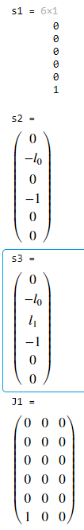

# 机器人学导论作业11-12

SZ170320207

刘健恒

## 


## **Matlab**

```matlab
syms l0 l1 l2 r0 r1 r2 theta1 theta2 theta3 real
syms m1 m2 m3 g Ix1 Iy1 Iz1 Ix2 Iy2 Iz2 Ix3 Iy3 Iz3 real

w1=[0;0;1];
w2=[-1;0;0];w3=w2;

q1=[0;0;0];
q2=[0;0;l0];
q3=[0;l1;l0];

v1 = -cross(w1,q1);
s1=[v1;w1]
v2 = -cross(w2,q2);
s2=[v2;w2]
v3 = -cross(w3,q3);
s3=[v3;w3]

expw1=angvec2r(theta1,w1);
expw2=angvec2r(theta2,w2);
expw3=angvec2r(theta3,w3);

exps1=[expw1,(eye(3)-expw1)*cross(w1,v1)+w1*w1'*v1*theta1;0,0,0,1];
exps2=[expw2,(eye(3)-expw2)*cross(w2,v2)+w2*w2'*v2*theta2;0,0,0,1];
exps3=[expw3,(eye(3)-expw3)*cross(w3,v3)+w3*w3'*v3*theta3;0,0,0,1];

gsl10=[eye(3),[0;0;r0];0,0,0,1];
s1_J1=Adjoint_ginv(gsl10)*s1;
J1 = [s1_J1,zeros(6,1),zeros(6,1)]

gsl20=[eye(3),[0;r1;l0];0,0,0,1];
s1_J2=Adjoint_ginv(exps2*gsl20)*s1;
s1_J2 = simplify(s1_J2);
s2_J2=Adjoint_ginv(gsl20)*s2;
J2 = [s1_J2,s2_J2,zeros(6,1)]

gsl30=[eye(3),[0;l1+r2;l0];0,0,0,1];
s1_J3=Adjoint_ginv(exps2*exps3*gsl30)*s1;
s1_J3 = simplify(s1_J3);
s2_J3=Adjoint_ginv(exps3*gsl30)*s2;
s2_J3=simplify(s2_J3);
s3_J3=Adjoint_ginv(gsl30)*s3;
s3_J3=simplify(s3_J3);
J3 = [s1_J3,s2_J3,s3_J3]

M1 = [m1,0,0,0,0,0;
    0,m1,0,0,0,0;
    0,0,m1,0,0,0;
    0,0,0,Ix1,0,0;
    0,0,0,0,Iy1,0;
    0,0,0,0,0,Iz1];
M2 = [m2,0,0,0,0,0;
    0,m2,0,0,0,0;
    0,0,m2,0,0,0;
    0,0,0,Ix2,0,0;
    0,0,0,0,Iy2,0;
    0,0,0,0,0,Iz2];
M3 = [m3,0,0,0,0,0;
    0,m3,0,0,0,0;
    0,0,m3,0,0,0;
    0,0,0,Ix3,0,0;
    0,0,0,0,Iy3,0;
    0,0,0,0,0,Iz3];

M = J1'*M1*J1 + J2'*M2*J2 + J3'*M3*J3;
M = simplify(M)

M = mat2cell(M,[1,1,1],[1,1,1]);

Gamma = sym(zeros(27,1));
t(1) = theta1;
t(2) = theta2;
t(3) = theta3;
for i=1:3
    for j=1:3
        for k=1:3
            n = (i-1)*9+(j-1)*3+(k-1)+1;
            fprintf("i:%i, j:%i, k:%i",i,j,k);
            Gamma(n,1) = simplify(1/2*(diff(M{i,j},t(k))+diff(M{i,k},t(j))-diff(M{k,j},t(i))));
        end
    end
end
Gamma

h1=r0;
h2=l0-r1*sin(theta2);
h3=l0-l1*sin(theta2)-r2*sin(theta2+theta3);
V = m1*g*h1+m2*g*h2+m3*g*h3;
N = [diff(V,theta1);diff(V,theta2);diff(V,theta3)]

```

## 输出




$M(\theta)=$

$\begin{array}{l}
\left(\begin{array}{ccc}
{\textrm{Iz}}_1 +m_3 \,{{\left(r_2 \,\mathrm{cos}\left(\theta_2 +\theta_3 \right)+l_1 \,\mathrm{cos}\left(\theta_2 \right)\right)}}^2 +{\textrm{Iz}}_3 \,{\mathrm{cos}\left(\theta_2 +\theta_3 \right)}^2 +{\textrm{Iy}}_3 \,{\mathrm{sin}\left(\theta_2 +\theta_3 \right)}^2 +{\textrm{Iz}}_2 \,{\mathrm{cos}\left(\theta_2 \right)}^2 +{\textrm{Iy}}_2 \,{\mathrm{sin}\left(\theta_2 \right)}^2 +m_2 \,{r_1 }^2 \,{\mathrm{cos}\left(\theta_2 \right)}^2  & 0 & 0\\
0 & m_3 \,{l_1 }^2 +2\,m_3 \,\mathrm{cos}\left(\theta_3 \right)\,l_1 \,r_2 +m_2 \,{r_1 }^2 +m_3 \,{r_2 }^2 +{\textrm{Ix}}_2 +{\textrm{Ix}}_3  & \sigma_1 \\
0 & \sigma_1  & m_3 \,{r_2 }^2 +{\textrm{Ix}}_3 
\end{array}\right)\\
\mathrm{}\\
\textrm{where}\\
\mathrm{}\\
\;\;\sigma_1 ={\textrm{Ix}}_3 +m_3 \,r_2 \,{\left(r_2 +l_1 \,\mathrm{cos}\left(\theta_3 \right)\right)}
\end{array}$

$\Gamma(\theta)(n,1)=$ 

$\begin{array}{l}
\left(\begin{array}{c}
0\\
\sigma_3 \\
-\sigma_1 \\
\sigma_3 \\
0\\
0\\
-\sigma_1 \\
0\\
0\\
\sigma_6 +\sigma_7 +\sigma_5 +\sigma_4 -\frac{{\textrm{Iy}}_3 \,\sigma_8 }{2}+\frac{{\textrm{Iz}}_3 \,\sigma_8 }{2}-\frac{{\textrm{Iy}}_2 \,\mathrm{sin}\left(2\,\theta_2 \right)}{2}+\frac{{\textrm{Iz}}_2 \,\mathrm{sin}\left(2\,\theta_2 \right)}{2}\\
0\\
0\\
0\\
0\\
\sigma_2 \\
0\\
\sigma_2 \\
\sigma_2 \\
\sigma_1 \\
0\\
0\\
0\\
l_1 \,m_3 \,r_2 \,\mathrm{sin}\left(\theta_3 \right)\\
0\\
0\\
0\\
0
\end{array}\right)\\
\mathrm{}\\
\textrm{where}\\
\mathrm{}\\
\;\;\sigma_1 =\mathrm{sin}\left(\theta_2 +\theta_3 \right)\,{\left(m_3 \,\mathrm{cos}\left(\theta_2 +\theta_3 \right)\,{r_2 }^2 +l_1 \,m_3 \,\mathrm{cos}\left(\theta_2 \right)\,r_2 -{\textrm{Iy}}_3 \,\mathrm{cos}\left(\theta_2 +\theta_3 \right)+{\textrm{Iz}}_3 \,\mathrm{cos}\left(\theta_2 +\theta_3 \right)\right)}\\
\mathrm{}\\
\;\;\sigma_2 =-l_1 \,m_3 \,r_2 \,\mathrm{sin}\left(\theta_3 \right)\\
\mathrm{}\\
\;\;\sigma_3 =-\sigma_6 -\sigma_7 -\sigma_5 -\sigma_4 +\frac{{\textrm{Iy}}_3 \,\sigma_8 }{2}-\frac{{\textrm{Iz}}_3 \,\sigma_8 }{2}+\frac{{\textrm{Iy}}_2 \,\mathrm{sin}\left(2\,\theta_2 \right)}{2}-\frac{{\textrm{Iz}}_2 \,\mathrm{sin}\left(2\,\theta_2 \right)}{2}\\
\mathrm{}\\
\;\;\sigma_4 =\frac{m_3 \,\sigma_8 \,{r_2 }^2 }{2}\\
\mathrm{}\\
\;\;\sigma_5 =\frac{m_2 \,\mathrm{sin}\left(2\,\theta_2 \right)\,{r_1 }^2 }{2}\\
\mathrm{}\\
\;\;\sigma_6 =\frac{m_3 \,\mathrm{sin}\left(2\,\theta_2 \right)\,{l_1 }^2 }{2}\\
\mathrm{}\\
\;\;\sigma_7 =m_3 \,\mathrm{sin}\left(2\,\theta_2 +\theta_3 \right)\,l_1 \,r_2 \\
\mathrm{}\\
\;\;\sigma_8 =\mathrm{sin}\left(2\,\theta_2 +2\,\theta_3 \right)
\end{array}**$

`n = (i-1)*9+(j-1)*3+(k-1)+1)`

$N(\theta)=$

$\left(\begin{array}{c}
0\\
-g\,m_3 \,{\left(r_2 \,\mathrm{cos}\left(\theta_2 +\theta_3 \right)+l_1 \,\mathrm{cos}\left(\theta_2 \right)\right)}-g\,m_2 \,r_1 \,\mathrm{cos}\left(\theta_2 \right)\\
-g\,m_3 \,r_2 \,\mathrm{cos}\left(\theta_2 +\theta_3 \right)
\end{array}\right)$

**经比对，matlab输出数据与结果一致**