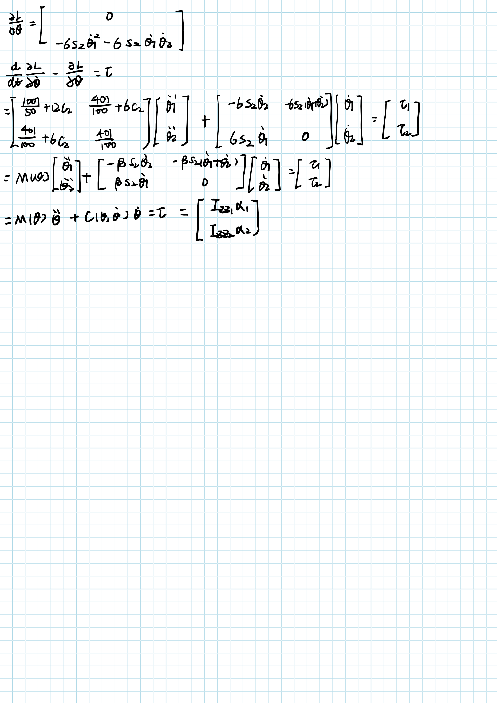

# 机器人学导论作业11-12

SZ170320207

刘健恒

# Question1

## 推导


## 结果

$\dot\theta_{12}=10.7180$

$\dot\theta_{23}=31.0102$

$t_{b1}=0.1340$

$t_{12}=0.7392$

$t_{b2}=0.2537$

$t_{23}=0.4855$

$t_{b3}=0.3876$ 


## 代码

```matlab
theta1 = 5;
theta2 = 15;
theta3 = 40;

acceleration_b = 80;

td12 = 1; 
td23 = 1;

subplot(3,1,1)
plot(0,theta1,'r*');
hold on;
plot(td12,theta2,'r*');
hold on;
plot(td12+td23,theta3,'r*');
hold on;

acceleration_1 = acceleration_b;
tb1 = td12 - sqrt(td12^2-2*(theta2-theta1)/acceleration_1)
velocity12 = (theta2-theta1)/(td12-tb1/2)

acceleration_3 = -acceleration_b;
tb3 = td23 - sqrt(td23^2 + 2*(theta3-theta2)/acceleration_3)
velocity23 = (theta3-theta2)/(td23-tb3/2)

acceleration_2 = acceleration_b;
tb2 = (velocity23-velocity12)/acceleration_2

t23 = td23 - tb2/2 - tb3

t12 = td12 - tb2/2 - tb1

t_b1 = 0:0.001:tb1;
p_b1 = theta1 + 1/2*acceleration_1*t_b1.^2;
v_b1 = acceleration_1*t_b1;
a_b1 = acceleration_1 + 0*t_b1;
t = t_b1;
p = p_b1;
v = v_b1;
a = a_b1;

t_12 = 0:0.001:t12;
p_12 = p_b1(end) + velocity12.*t_12;
v_12 = v_b1(end) + 0 * t_12;
a_12 = 0*t_12;
t = [t t_12+t(end)];
p = [p p_12];
v = [v v_12];
a = [a a_12];

t_b2 = 0:0.001:tb2;
p_b2 = p_12(end) + v_12(end)*t_b2 + 1/2*acceleration_2*t_b2.^2;
v_b2 = v_12(end) + acceleration_2*t_b2;
a_b2 = acceleration_2 +0*t_b2;
t = [t t_b2+t(end)];
p = [p p_b2];
v = [v v_b2];
a = [a a_b2];

t_23 = 0:0.001:t23;
p_23 = p_b2(end) + velocity23*t_23;
v_23 = v_b2(end) + 0*t_23;
a_23 = 0*t_23;
t = [t t_23+t(end)];
p = [p p_23];
v = [v v_23];
a = [a a_23];

t_b3 = 0:0.001:tb3;
p_b3 = p_23(end) + v_23(end)*t_b3 + 1/2*acceleration_3*t_b3.^2;
v_b3 = v_23(end) + acceleration_3*t_b3;
a_b3 = acceleration_3 + 0*t_b3;
t = [t t_b3+t(end)];
p = [p p_b3];
v = [v v_b3];
a = [a a_b3];

subplot(3,1,1)
plot(t,p,'b')
title('position')
subplot(3,1,2)
plot(t,v,'b')
title('velocity')
subplot(3,1,3)
plot(t,a,'b')
title('acceleration')
        

```

# Question2

## 推导


## 结果

第一段参数

$a_{01}=5$

$a_{11}=0$

$a_{21}=7.5000$

$a_{31}=-2.5000$

第一段参数

$a_{02}=15$

$a_{12}=0$

$a_{22}=-18.7500$

$a_{32}=6.2500$


## 代码

```matlab
theta0 = 5;
thetav = 15;
thetag = -10;

td = 2;

subplot(3,1,1)
plot(0,theta0,'r*');
hold on;
plot(td,thetav,'r*');
hold on;
plot(td+td,thetag,'r*');
hold on;

v0 = 0;
vv = 0;
vg = 0;

h0v = thetav - theta0;
a01 = theta0;
a11 = v0;
a21 = (3*h0v-(2*v0+vv)*td)/td^2;
a31 = (-2*h0v+(v0+vv)*td)/td^3;

t1 = 0:0.01:td;
p1 = a01 + a11*t1 + a21*t1.^2 + a31*t1.^3;
v1 = a11 + 2*a21*t1 + 3*a31*t1.^2;
a1 = 2*a21 + 6*a31*t1;
t = t1;
p = p1;
v = v1;
a = a1;

h1v = thetag - thetav;
a02 = thetav;
a12 = vv;
a22 = (3*h1v-(2*vv+vg)*td)/td^2;
a32 = (-2*h1v+(vv+vg)*td)/td^3;

t2 = 0:0.01:td;
p2 = a02 + a12*t2 + a22*t2.^2 + a32*t2.^3;
v2 = a12 + 2*a22*t2 + 3*a32*t2.^2;
a2 = 2*a22 + 6*a32*t2;
t = [t t2+t(end)];
p = [p p2];
v = [v v2];
a = [a a2];

subplot(3,1,1)
plot(t,p,'b')
title('position')
subplot(3,1,2)
plot(t,v,'b')
title('velocity')
subplot(3,1,3)
plot(t,a,'b')
title('acceleration')
```

# Question3

$\theta(t)=10+90t^2-60t^3$

$\dot\theta(t)=180t-180t^2$

$\ddot\theta(t)=180-360t$

所以

起始点：

$t_0 = 0$

$p_0 = \theta(0) = 10$ 

$v_0 = \dot\theta(0) = 0$ 

$a_0 = \ddot\theta(0) = 180$ 

终止点：

$t_f = 1$

$p_f = \theta(1) = 40$ 

$v_f = \dot\theta(1) = 0$ 

$a_f = \ddot\theta(1) = -180$ 


# Question4

## 推导


## 结果


## 代码

```matlab
P1 = [0;0];
P2 = [2;1];
P3 = [3;3];

acceleration_b = [6;6];

td12 = 1; 
td23 = 1;

plot3(0,P1(1),P1(2),'r*');
hold on;
plot3(td12,P2(1),P2(2),'r*');
hold on;
plot3(td12+td23,P3(1),P3(2),'r*');
hold on;

acceleration_1 = sign(P2 - P1).*acceleration_b;
tb1 = td12 - sqrt(td12^2-2*(P2-P1)./acceleration_1)
velocity12 = (P2-P1)./(td12-tb1/2)

acceleration_3 = sign(P2 - P3).*acceleration_b
tb3 = td23 - sqrt(td23^2 + 2*(P3-P2)./acceleration_3)
velocity23 = (P3-P2)./(td23-tb3/2)

acceleration_2 = sign(velocity23-velocity12).*acceleration_b
tb2 = (velocity23-velocity12)./(acceleration_2)

t23 = td23 - tb2/2 - tb3

t12 = td12 - tb2/2 - tb1

t_b1x = 0:0.001:tb1(1);
p_b1x = P1(1) + 1/2*acceleration_1(1)*t_b1x.^2;
v_b1x = acceleration_1(1)*t_b1x;
a_b1x = acceleration_1(1) + 0*t_b1x;
tx = t_b1x;
px = p_b1x;
vx = v_b1x;
ax = a_b1x;

t_b1y = 0:0.001:tb1(2);
p_b1y = P1(2) + 1/2*acceleration_1(2)*t_b1y.^2;
v_b1y = acceleration_1(2)*t_b1y;
a_b1y = acceleration_1(2) + 0*t_b1y;
ty = t_b1y;
py = p_b1y;
vy = v_b1y;
ay = a_b1y;

t_12x = 0:0.001:t12(1);
p_12x = px(end) + velocity12(1).*t_12x;
v_12x = vx(end) + 0 * t_12x;
a_12x = 0*t_12x;
tx = [tx t_12x+tx(end)];
px = [px p_12x];
vx = [vx v_12x];
ax = [ax a_12x];

t_12y = 0:0.001:t12(2);
p_12y = py(end) + velocity12(2).*t_12y;
v_12y = vy(end) + 0 * t_12y;
a_12y = 0*t_12y;
ty = [ty t_12y+ty(end)];
py = [py p_12y];
vy = [vy v_12y];
ay = [ay a_12y];

t_b2x = 0:0.001:tb2(1);
p_b2x = px(end) + vx(end)*t_b2x + 1/2*acceleration_2(1)*t_b2x.^2;
v_b2x = vx(end) + acceleration_2(1)*t_b2x;
a_b2x = acceleration_2(1) +0*t_b2x;
tx = [tx t_b2x+tx(end)];
px = [px p_b2x];
vx = [vx v_b2x];
ax = [ax a_b2x];

t_b2y = 0:0.001:tb2(2);
p_b2y = py(end) + vy(end)*t_b2y + 1/2*acceleration_2(2)*t_b2y.^2;
v_b2y = vy(end) + acceleration_2(2)*t_b2y;
a_b2y = acceleration_2(2) +0*t_b2y;
ty = [ty t_b2y+ty(end)];
py = [py p_b2y];
vy = [vy v_b2y];
ay = [ay a_b2y];

t_23x = 0:0.001:t23(1);
p_23x = px(end) + velocity23(1)*t_23x;
v_23x = vx(end) + 0*t_23x;
a_23x = 0*t_23x;
tx = [tx t_23x+tx(end)];
px = [px p_23x];
vx = [vx v_23x];
ax = [ax a_23x];

t_23y = 0:0.001:t23(2);
p_23y = py(end) + velocity23(2)*t_23y;
v_23y = vy(end) + 0*t_23y;
a_23y = 0*t_23y;
ty = [ty t_23y+ty(end)];
py = [py p_23y];
vy = [vy v_23y];
ay = [ay a_23y];

t_b3x = 0:0.001:tb3(1);
p_b3x = px(end) + vx(end)*t_b3x + 1/2*acceleration_3(1)*t_b3x.^2;
v_b3x = v_23x(end) + acceleration_3(1)*t_b3x;
a_b3x = acceleration_3(1) + 0*t_b3x;
tx = [tx t_b3x+tx(end)];
px = [px p_b3x];
vx = [vx v_b3x];
ax = [ax a_b3x];

t_b3y = 0:0.001:tb3(2);
p_b3y = py(end) + vy(end)*t_b3y + 1/2*acceleration_3(2)*t_b3y.^2;
v_b3y = v_23y(end) + acceleration_3(2)*t_b3y;
a_b3y = acceleration_3(2) + 0*t_b3y;
ty = [ty t_b3y+ty(end)];
py = [py p_b3y];
vy = [vy v_b3y];
ay = [ay a_b3y];

t = 0:0.001:2.001;
plot3(t,px,py,'b')
xlabel('t')
ylabel('x')
zlabel('y')
grid on
title('position')
% subplot(2,2,1)
% plot(t,vx,'b')
% xlabel('t')
% ylabel('vx')
% grid on
% title('velocity-x')
% subplot(2,2,2)
% plot(t,vy,'b')
% xlabel('t')
% ylabel('vy')
% grid on
% title('velocity-y')
% subplot(2,2,3)
% plot(t,ax,'b')
% xlabel('t')
% ylabel('ax')
% grid on
% title('acceleration-x')
% subplot(2,2,4)
% plot(t,ay,'b')
% xlabel('t')
% ylabel('ay')
% grid on
% title('acceleration-y')
```


# Question5

## (a)




## (b)

### Problem1


```matlab
degree2rad = pi/180;

theta1 = 5;
theta2 = 15;
theta3 = 40;

acceleration_b = 80;

td12 = 1;
td23 = 1;

subplot(3,2,1)
plot(0,theta1,'r*');
hold on;
plot(td12,theta2,'r*');
hold on;
plot(td12+td23,theta3,'r*');
hold on;

acceleration_1 = acceleration_b;
tb1 = td12 - sqrt(td12^2-2*(theta2-theta1)/acceleration_1)
velocity12 = (theta2-theta1)/(td12-tb1/2)

acceleration_3 = -acceleration_b;
tb3 = td23 - sqrt(td23^2 + 2*(theta3-theta2)/acceleration_3)
velocity23 = (theta3-theta2)/(td23-tb3/2)

acceleration_2 = acceleration_b;
tb2 = (velocity23-velocity12)/acceleration_2

t23 = td23 - tb2/2 - tb3

t12 = td12 - tb2/2 - tb1

t_b1 = 0:0.001:tb1;
p_b1 = theta1 + 1/2*acceleration_1*t_b1.^2;
v_b1 = acceleration_1*t_b1;
a_b1 = acceleration_1 + 0*t_b1;
t = t_b1;
p = p_b1;
v = v_b1;
a = a_b1;

t_12 = 0:0.001:t12;
p_12 = p_b1(end) + velocity12.*t_12;
v_12 = v_b1(end) + 0 * t_12;
a_12 = 0*t_12;
t = [t t_12+t(end)];
p = [p p_12];
v = [v v_12];
a = [a a_12];

t_b2 = 0:0.001:tb2;
p_b2 = p_12(end) + v_12(end)*t_b2 + 1/2*acceleration_2*t_b2.^2;
v_b2 = v_12(end) + acceleration_2*t_b2;
a_b2 = acceleration_2 +0*t_b2;
t = [t t_b2+t(end)];
p = [p p_b2];
v = [v v_b2];
a = [a a_b2];

t_23 = 0:0.001:t23;
p_23 = p_b2(end) + velocity23*t_23;
v_23 = v_b2(end) + 0*t_23;
a_23 = 0*t_23;
t = [t t_23+t(end)];
p = [p p_23];
v = [v v_23];
a = [a a_23];

t_b3 = 0:0.001:tb3;
p_b3 = p_23(end) + v_23(end)*t_b3 + 1/2*acceleration_3*t_b3.^2;
v_b3 = v_23(end) + acceleration_3*t_b3;
a_b3 = acceleration_3 + 0*t_b3;
t = [t t_b3+t(end)];
p = [p p_b3];
v = [v v_b3];
a = [a a_b3];

subplot(3,2,1)
plot(t,p,'b')
title('position')
subplot(3,2,3)
plot(t,v,'b')
title('velocity')
subplot(3,2,5)
plot(t,a,'b')
title('acceleration')

% 机械臂参数
m1 = 12;
m2 = 12;

l1 = 1;
l2 = 1;

r1 = 0.5;
r2 = 0.5;

I1 = [0.0125,0,0;0,1.0025,0;0,0,1.01];
I2 = I1;

% 运动学方程
alpha = I1(3,3)+I2(3,3)+m1*r1^2+m2*(l1^2+r2^2)
beta = m2*l1*r2
delta = I2(3,3)+m2*r2^2

torque = zeros(2,length(t(:)));
for k=1:length(t(:))
    theta1 = p(1,k)*degree2rad;
    theta2 = p(1,k)*degree2rad;
    dtheta1 = v(1,k)*degree2rad;
    dtheta2 = v(1,k)*degree2rad;
    ddtheta1 = a(1,k)*degree2rad;
    ddtheta2 = a(1,k)*degree2rad;
    M = [alpha+2*beta*cos(theta2),delta+beta*cos(theta2);
        delta+beta*cos(theta2), delta];
    C = [-beta*sin(theta2)*dtheta2,-beta*sin(theta2)*(dtheta1+dtheta2);
        beta*sin(theta2)*dtheta1,0];
    torque(:,k) = M*[ddtheta1;ddtheta2]+C*[dtheta1;dtheta2];
end
subplot(3,2,2)
plot(t,torque(1,:));
title('Torque1');
subplot(3,2,4)
plot(t,torque(2,:));
title('Torque2');
```

### Problem2


```matlab
degree2rad = pi/180;

theta0 = 5;
thetav = 15;
thetag = -10;

td = 2;

subplot(3,2,1)
plot(0,theta0,'r*');
hold on;
plot(td,thetav,'r*');
hold on;
plot(td+td,thetag,'r*');
hold on;

v0 = 0;
vv = 0;
vg = 0;

h0v = thetav - theta0;
a01 = theta0
a11 = v0
a21 = (3*h0v-(2*v0+vv)*td)/td^2
a31 = (-2*h0v+(v0+vv)*td)/td^3

t1 = 0:0.01:td;
p1 = a01 + a11*t1 + a21*t1.^2 + a31*t1.^3;
v1 = a11 + 2*a21*t1 + 3*a31*t1.^2;
a1 = 2*a21 + 6*a31*t1;
t = t1;
p = p1;
v = v1;
a = a1;

h1v = thetag - thetav;
a02 = thetav
a12 = vv
a22 = (3*h1v-(2*vv+vg)*td)/td^2
a32 = (-2*h1v+(vv+vg)*td)/td^3

t2 = 0:0.01:td;
p2 = a02 + a12*t2 + a22*t2.^2 + a32*t2.^3;
v2 = a12 + 2*a22*t2 + 3*a32*t2.^2;
a2 = 2*a22 + 6*a32*t2;
t = [t t2+t(end)];
p = [p p2];
v = [v v2];
a = [a a2];

subplot(3,2,1)
plot(t,p,'b')
title('position')
subplot(3,2,3)
plot(t,v,'b')
title('velocity')
subplot(3,2,5)
plot(t,a,'b')
title('acceleration')

% 机械臂参数
m1 = 12;
m2 = 12;

l1 = 1;
l2 = 1;

r1 = 0.5;
r2 = 0.5;

I1 = [0.0125,0,0;0,1.0025,0;0,0,1.01];
I2 = I1;

% 运动学方程
alpha = I1(3,3)+I2(3,3)+m1*r1^2+m2*(l1^2+r2^2)
beta = m2*l1*r2
delta = I2(3,3)+m2*r2^2

torque = zeros(2,length(t(:)));
for k=1:length(t(:))
    theta1 = p(1,k)*degree2rad;
    theta2 = p(1,k)*degree2rad;
    dtheta1 = v(1,k)*degree2rad;
    dtheta2 = v(1,k)*degree2rad;
    ddtheta1 = a(1,k)*degree2rad;
    ddtheta2 = a(1,k)*degree2rad;
    M = [alpha+2*beta*cos(theta2),delta+beta*cos(theta2);
        delta+beta*cos(theta2), delta];
    C = [-beta*sin(theta2)*dtheta2,-beta*sin(theta2)*(dtheta1+dtheta2);
        beta*sin(theta2)*dtheta1,0];
    torque(:,k) = M*[ddtheta1;ddtheta2]+C*[dtheta1;dtheta2];
end
subplot(3,2,2)
plot(t,torque(1,:));
title('Torque1');
subplot(3,2,4)
plot(t,torque(2,:));
title('Torque2');
```

## (c)

### (i)Computed torque

#### Problem1

Kp = 80;
Kv = 100;

无饱和力矩


有饱和力矩


#### Problem2

Kp = 80;
Kv = 100;

无饱和力矩


有饱和力矩


#### 代码

```matlab
clc
clear
% 初始化机械臂参数
theta = [deg2rad(5);deg2rad(5)];
dtheta = [0;0];
ddtheta = [0;0];

% 获取期望轨迹
[theta_desired,dtheta_desired,ddtheta_desired] = trajectory_problem2();

for t = 0:0.001:4.001
    %     计算误差
    k = int16(t*1000+1);
    theta_error = theta_desired(:,k) - theta;
    dtheta_error = dtheta_desired(:,k) - dtheta;
    theta_error_plot(:,k) = theta_error;
    % 更新M，C矩阵
    [M,C]=compute_MC(theta,dtheta);
    [M_desired,C_desired]=compute_MC(theta_desired(:,k),dtheta_desired(:,k));
    %     更新期望加速度
    ddtheta_desired_t = ddtheta_desired(:,k);
    %   获取无饱和的期望力矩
    torque_desired(:,k) = M_desired*ddtheta_desired(:,k)+C_desired*dtheta_desired(:,k);
    % 获取ComputedTorque控制器的输出力矩
    Kp = 80;
    Kv = 100;
    torque = M*(ddtheta_desired_t+Kv*dtheta_error+Kp*theta_error)+C*dtheta;
    if abs(torque(1,1)) >= 20
        torque(1,1) = torque(1,1)/abs(torque(1,1))*20;
    end
    if abs(torque(2,1)) >= 20
        torque(2,1) = torque(2,1)/abs(torque(2,1))*20;
    end
    torque_plot(:,k) = torque;
    %     真实关节加速度
    ddtheta = inv(M)*(torque-C*dtheta);
    ddtheta_plot(:,k) = ddtheta;
    dtheta = dtheta + ddtheta*0.001;
    dtheta_plot(:,k) = dtheta;
    theta = theta + dtheta*0.001 + ddtheta*0.001^2/2;
    theta_plot(:,k) = theta;
end
t = 0:0.001:4.001;
subplot(4,2,1)
plot(t,theta_plot(1,:),'r');
hold on
plot(t,theta_desired(1,:),'b');
title('theta1')
legend('实际输出','期望输出');
subplot(4,2,3)
plot(t,dtheta_plot(1,:),'r');
hold on
plot(t,dtheta_desired(1,:),'b');
legend('实际输出','期望输出');
title('dtheta1')
subplot(4,2,5)
plot(t,torque_plot(1,:),'r');
hold on
plot(t,torque_desired(1,:),'b');
title('torque1')
legend('实际输出','期望输出');
subplot(4,2,7)
plot(t,theta_error_plot(1,:),'b');
title('theta_error1')

subplot(4,2,2)
plot(t,theta_plot(2,:),'r');
hold on
plot(t,theta_desired(2,:),'b');
title('theta2')
legend('实际输出','期望输出');
subplot(4,2,4)
plot(t,dtheta_plot(2,:),'r');
hold on
plot(t,dtheta_desired(2,:),'b');
legend('实际输出','期望输出');
title('dtheta2')
subplot(4,2,6)
plot(t,torque_plot(2,:),'r');
hold on
plot(t,torque_desired(2,:),'b');
title('torque2')
legend('实际输出','期望输出');
subplot(4,2,8)
plot(t,theta_error_plot(2,:),'b');
title('theta_error2')
```


### (ii)PD Control

#### Problem1

Kp = 200;
Kv = 1500;

无饱和力矩


有饱和力矩


#### Problem2

Kp = 200;
Kv = 1500;

无饱和力矩


有饱和力矩


#### 代码

```matlab
clc
clear
% 初始化机械臂参数
theta = [deg2rad(5);deg2rad(5)];
dtheta = [0;0];
ddtheta = [0;0];

% 获取M，C矩阵
[M,C]=compute_MC(theta,dtheta);

% 获取期望轨迹
[theta_desired,dtheta_desired,ddtheta_desired] = trajectory_problem2();

for t = 0:0.001:4.001
    %     计算误差
    k = int16(t*1000+1);
    theta_error = theta_desired(:,k) - theta;
    dtheta_error = dtheta_desired(:,k) - dtheta;
    theta_error_plot(:,k) = theta_error;
    % 更新M，C矩阵
    [M,C]=compute_MC(theta,dtheta);
    [M_desired,C_desired]=compute_MC(theta_desired(:,k),dtheta_desired(:,k));
    %     更新期望加速度
    ddtheta_desired_t = ddtheta_desired(:,k);
    %   获取无饱和的期望力矩
    torque_desired(:,k) = M_desired*ddtheta_desired(:,k)+C_desired*dtheta_desired(:,k);
    % 获取PD控制器的输出力矩
    Kp = 200;
    Kv = 1500;
    torque = Kp*theta_error+Kv*dtheta_error;
    %     饱和函数
    if abs(torque(1,1)) >= 20
        torque(1,1) = torque(1,1)/abs(torque(1,1))*20;
    end
    if abs(torque(2,1)) >= 20
        torque(2,1) = torque(2,1)/abs(torque(2,1))*20;
    end
    torque_plot(:,k) = torque;
    %     真实关节加速度
    ddtheta = inv(M)*(torque-C*dtheta);
    ddtheta_plot(:,k) = ddtheta;
    dtheta = dtheta + ddtheta*0.001;
    dtheta_plot(:,k) = dtheta;
    theta = theta + dtheta*0.001 + ddtheta*0.001^2/2;
    theta_plot(:,k) = theta;
end
t = 0:0.001:4.001;
subplot(4,2,1)
plot(t,theta_plot(1,:),'r');
hold on
plot(t,theta_desired(1,:),'b');
title('theta1')
legend('实际输出','期望输出');
subplot(4,2,3)
plot(t,dtheta_plot(1,:),'r');
hold on
plot(t,dtheta_desired(1,:),'b');
legend('实际输出','期望输出');
title('dtheta1')
subplot(4,2,5)
plot(t,torque_plot(1,:),'r');
hold on
plot(t,torque_desired(1,:),'b');
title('torque1')
legend('实际输出','期望输出');
subplot(4,2,7)
plot(t,theta_error_plot(1,:),'b');
title('theta_error1')

subplot(4,2,2)
plot(t,theta_plot(2,:),'r');
hold on
plot(t,theta_desired(2,:),'b');
title('theta2')
legend('实际输出','期望输出');
subplot(4,2,4)
plot(t,dtheta_plot(2,:),'r');
hold on
plot(t,dtheta_desired(2,:),'b');
legend('实际输出','期望输出');
title('dtheta2')
subplot(4,2,6)
plot(t,torque_plot(2,:),'r');
hold on
plot(t,torque_desired(2,:),'b');
title('torque2')
legend('实际输出','期望输出');
subplot(4,2,8)
plot(t,theta_error_plot(2,:),'b');
title('theta_error2')
```


### (iii)Augmented PD control

#### Problem1

Kp = 150;
Kv = 50;

无饱和力矩


有饱和力矩


#### Problem2

Kp = 150;
Kv = 50;

无饱和力矩


有饱和力矩


#### 代码

```matlab
clc
clear
% 初始化机械臂参数
theta = [deg2rad(5);deg2rad(5)];
dtheta = [0;0];
ddtheta = [0;0];

% 获取M，C矩阵
[M,C]=compute_MC(theta,dtheta);

% 获取期望轨迹
[theta_desired,dtheta_desired,ddtheta_desired] = trajectory_problem2();

for t = 0:0.001:4.001
    %     计算误差
    k = int16(t*1000+1);
    theta_error = theta_desired(:,k) - theta;
    dtheta_error = dtheta_desired(:,k) - dtheta;
    theta_error_plot(:,k) = theta_error;
    % 更新M，C矩阵
    [M,C]=compute_MC(theta,dtheta);
    [M_desired,C_desired]=compute_MC(theta_desired(:,k),dtheta_desired(:,k));
    %     更新期望速度
    dtheta_desired_t = dtheta_desired(:,k);
    %     更新期望加速度
    ddtheta_desired_t = ddtheta_desired(:,k);
    %   获取无饱和的期望力矩
    torque_desired(:,k) = M_desired*ddtheta_desired(:,k)+C_desired*dtheta_desired(:,k);
    % 获取AugmentedPD控制器的输出力矩
    Kp = 150;
    Kv = 50;
    torque = M*ddtheta_desired_t + C*dtheta_desired_t + Kp*theta_error + Kv*dtheta_error;
    %     饱和函数
    if abs(torque(1,1)) >= 20
        torque(1,1) = torque(1,1)/abs(torque(1,1))*20;
    end
    if abs(torque(2,1)) >= 20
        torque(2,1) = torque(2,1)/abs(torque(2,1))*20;
    end
    torque_plot(:,k) = torque;
    %     真实关节加速度
    ddtheta = inv(M)*(torque-C*dtheta);
    ddtheta_plot(:,k) = ddtheta;
    dtheta = dtheta + ddtheta*0.001;
    dtheta_plot(:,k) = dtheta;
    theta = theta + dtheta*0.001 + ddtheta*0.001^2/2;
    theta_plot(:,k) = theta;
end
t = 0:0.001:4.001;
subplot(4,2,1)
plot(t,theta_plot(1,:),'r');
hold on
plot(t,theta_desired(1,:),'b');
title('theta1')
legend('实际输出','期望输出');
subplot(4,2,3)
plot(t,dtheta_plot(1,:),'r');
hold on
plot(t,dtheta_desired(1,:),'b');
legend('实际输出','期望输出');
title('dtheta1')
subplot(4,2,5)
plot(t,torque_plot(1,:),'r');
hold on
plot(t,torque_desired(1,:),'b');
title('torque1')
legend('实际输出','期望输出');
subplot(4,2,7)
plot(t,theta_error_plot(1,:),'b');
title('theta_error1')

subplot(4,2,2)
plot(t,theta_plot(2,:),'r');
hold on
plot(t,theta_desired(2,:),'b');
title('theta2')
legend('实际输出','期望输出');
subplot(4,2,4)
plot(t,dtheta_plot(2,:),'r');
hold on
plot(t,dtheta_desired(2,:),'b');
legend('实际输出','期望输出');
title('dtheta2')
subplot(4,2,6)
plot(t,torque_plot(2,:),'r');
hold on
plot(t,torque_desired(2,:),'b');
title('torque2')
legend('实际输出','期望输出');
subplot(4,2,8)
plot(t,theta_error_plot(2,:),'b');
title('theta_error2')
```

### 控制参数与位置误差的关系

以Augmented PD控制器为例

Kp = 150; Kv = 50;


Kp = 500; Kv = 50;


Kp = 1000; Kv = 50;


比例系数的增大可有效降低跟踪误差，但可能会导致震荡

Kp = 150; Kv =10;


Kp = 150; Kv =50;


Kp = 150; Kv =200;


微分系数的增大可有效降低跟踪误差，但可能会对变化大的输入响应剧烈导致饱和。同时随着微分系数的增大，其对降低跟踪误差的效率也下降

### 结论

综上，可以看出在相同参数下，使用三次多项式规划的轨迹比使用LFPB规划的轨迹在实际控制中可以获得更加平滑且更加优异的跟踪性能。

而对于不同的控制器，Augmented PD控制器最优


