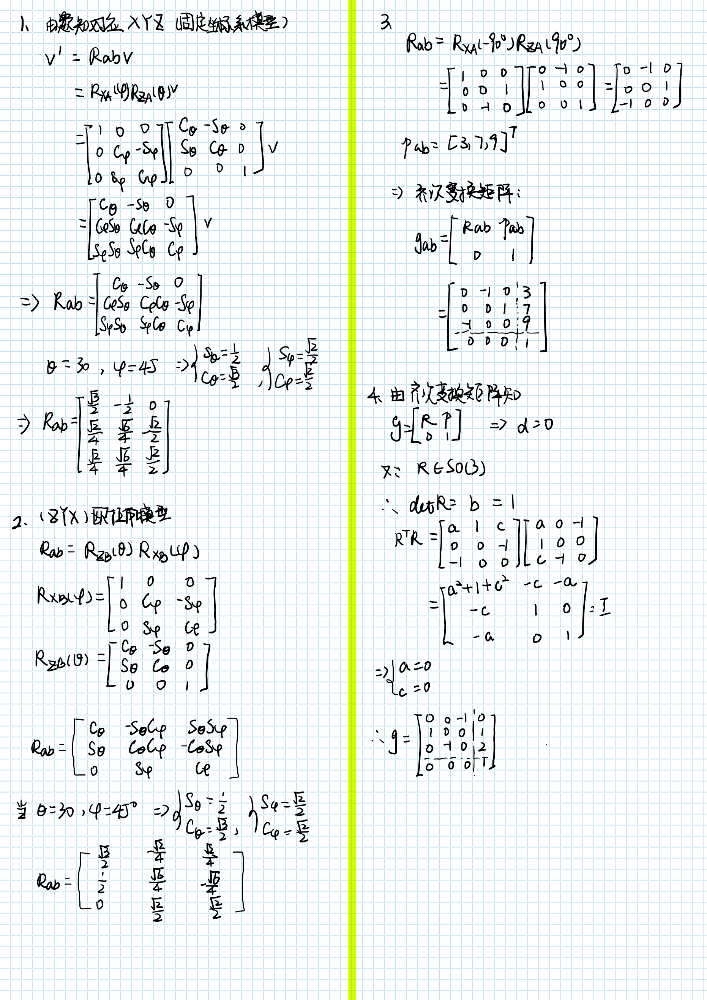
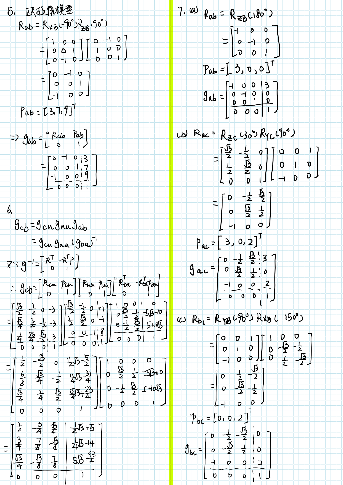
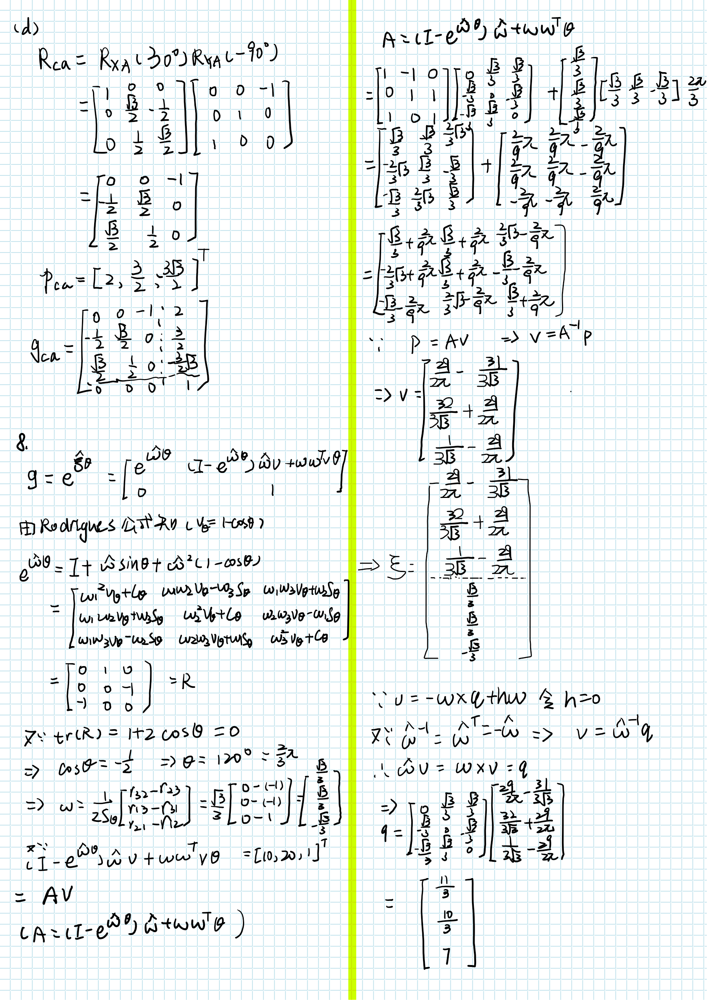

# 机器人学导论作业3-4

SZ170320207

刘健恒







## 9.

### （a）

#### **zyz2exp**

```matlab
function [axis,theta] = zyz2exp(angleZ1,angleY2,angleZ3)
% please input angle in rad
% number behind represents order
RZ1 = [cos(angleZ1), -sin(angleZ1),0;
       sin(angleZ1), cos(angleZ1), 0;
       0,            0,            1];
RY2 = [cos(angleY2), 0,            sin(angleY2);
       0,            1,            0;
       -sin(angleY2),0,            cos(angleY2)];
RZ3 = [cos(angleZ3),-sin(angleZ3),0;
       sin(angleZ3),cos(angleZ3), 0;
       0,           0,            1];
R = RZ1*RY2*RZ3
trR = R(1,1)+R(2,2)+R(3,3);
% acos->arccos
theta = acos((trR-1)/2);
axis = [R(3,2)-R(2,3);
        R(1,3)-R(3,1);
        R(2,1)-R(1,2)];
axis = axis/(2*sin(theta));
theta= theta/pi*180;

if trR == 3
    fprintf("R=I\n");
elseif trR==-1
    fprintf("Singularity!\n")
end

end
```

##### **实验例子**

1)

```matlab
>> [axis,theta]=zyz2exp(0,0,pi/3)

R =

    0.5000   -0.8660         0
    0.8660    0.5000         0
         0         0    1.0000


axis =

         0
         0
    1.0000


theta =

   60.0000
```

2)

```matlab
>> [axis,theta]=zyz2exp(pi/4,pi/3,pi/6)

R =

   -0.0474   -0.7891    0.6124
    0.6597    0.4356    0.6124
   -0.7500    0.4330    0.5000


axis =

   -0.0898
    0.6823
    0.7256


theta =

   93.2037
```


#### **exp2zyz**

```matlab
function [angleZ1,angleY2,angleZ3] = exp2zyz(axis,theta)
% please input angle in rad
% angleZ1->gama,angleY2->beta,angleZ3->alpha
% number behind represents order
axis_h=[0,       -axis(3),axis(2);
        axis(3), 0,       -axis(1);
        -axis(2),axis(1), 0];
R=eye(3)+axis_h*sin(theta)+(axis_h^2)*(1-cos(theta))

angleY2 = atan2(sqrt(R(3,1)^2+R(3,2)^2),R(3,3));
angleZ3 = atan2(R(2,3)/sin(angleY2),R(1,3)/sin(angleY2));
angleZ1 = atan2(R(3,2)/sin(angleY2),-R(3,1)/sin(angleY2));

angleY2 = angleY2/pi*180;
angleZ3 = angleZ3/pi*180;
angleZ1 = angleZ1/pi*180;

if angleY2==0 || angleY2==180
    fprintf("Singularity!\n")
end

end
```

##### **实验例子**

1)

```matlab
>> [angleZ1,angleY2,angleZ3]=exp2zyz([0;0;1],pi/3)

R =

    0.5000   -0.8660         0
    0.8660    0.5000         0
         0         0    1.0000

Singularity!

angleZ1 =

   NaN


angleY2 =

     0


angleZ3 =

   NaN
```


2)

```matlab
>> [angleZ1,angleY2,angleZ3]=exp2zyz([-0.0898;0.6823;0.7256],93.2037/180*pi)

R =

   -0.0475   -0.7892    0.6124
    0.6598    0.4356    0.6124
   -0.7500    0.4331    0.4999


angleZ1 =

   44.9986


angleY2 =

   60.0051


angleZ3 =

   30.0030
```

#### 结果分析

分别使用`zyz2exp`和`exp2zyz`分别对两组实验数据进行验证，两函数所得结果相符，并且能够顺利识别出奇异角。

### （b）

#### **rpy2exp**

```matlab
function [axis,theta] = rpy2exp(angleR1,angleP2,angleY3)
% please input angle in rad
% R->X, P->Y, Y->Z
% number behind represents order
RR1 = [1,            0,            0;
       0,            cos(angleR1), -sin(angleR1);
       0,            sin(angleR1), cos(angleR1)];
RY2 = [cos(angleP2), 0,            sin(angleP2);
       0,            1,            0;
       -sin(angleP2),0,            cos(angleP2)];
RY3 = [cos(angleY3),-sin(angleY3),0;
       sin(angleY3),cos(angleY3), 0;
       0,           0,            1];
R = RY3*RY2*RR1
trR = R(1,1)+R(2,2)+R(3,3);
% acos->arccos
theta = acos((trR-1)/2);
axis = [R(3,2)-R(2,3);
        R(1,3)-R(3,1);
        R(2,1)-R(1,2)];
axis = axis/(2*sin(theta));
theta= theta/pi*180;

if trR == 3
    fprintf("R=I\n");
elseif trR==-1
    fprintf("Singularity!\n")
end

end
```

##### **实验例子**

1）

```matlab
>> [axis,theta]=rpy2exp(0,0,pi/3)

R =

    0.5000   -0.8660         0
    0.8660    0.5000         0
         0         0    1.0000


axis =

         0
         0
    1.0000


theta =

   60.0000
```

2)

```matlab
>> [axis,theta]=rpy2exp(pi/4,pi/3,pi/6)

R =

    0.4330    0.1768    0.8839
    0.2500    0.9186   -0.3062
   -0.8660    0.3536    0.3536


axis =

    0.3525
    0.9350
    0.0391


theta =

   69.3559
```

#### **exp2rpy**

```matlab
function [angleR1,angleP2,angleY3] = exp2rpy(axis,theta)
% please input angle in rad
% angleR1->Roll(X),angleP2->Pitch(Y),angleY3->Yaw(Z)
% number behind represents order
axis_h=[0,       -axis(3),axis(2);
        axis(3), 0,       -axis(1);
        -axis(2),axis(1), 0];
R=eye(3)+axis_h*sin(theta)+(axis_h^2)*(1-cos(theta))

angleP2 = atan2(-R(3,1),sqrt(R(3,2)^2+R(3,3)^2));
angleY3 = atan2(R(2,1)/cos(angleP2),R(1,1)/cos(angleP2));
angleR1 = atan2(R(3,2)/cos(angleP2),R(3,3)/cos(angleP2));

angleP2 = angleP2/pi*180;
angleY3 = angleY3/pi*180;
angleR1 = angleR1/pi*180;

if angleP2==90 || angleP2==-90
    fprintf("Singularity!\n")
end

end
```

##### **实验例子**

1）

```matlab
>> [angleR1,angleP2,angleY3] = exp2rpy([0;0;1],60/180*pi)

R =

    0.5000   -0.8660         0
    0.8660    0.5000         0
         0         0    1.0000


angleR1 =

     0


angleP2 =

     0


angleY3 =

    60
```

2)

```matlab
>> [angleR1,angleP2,angleY3] = exp2rpy([0.3525;0.9350;0.0391],69.3559/180*pi)

R =

    0.4330    0.1768    0.8839
    0.2500    0.9186   -0.3062
   -0.8660    0.3535    0.3535


angleR1 =

   44.9991


angleP2 =

   60.0013


angleY3 =

   29.9982
```

#### 结果分析

分别使用`rpy2exp`和`exp2rpy`分别对两组实验数据进行验证，两函数所得结果相符，并且能够顺利识别出奇异角。