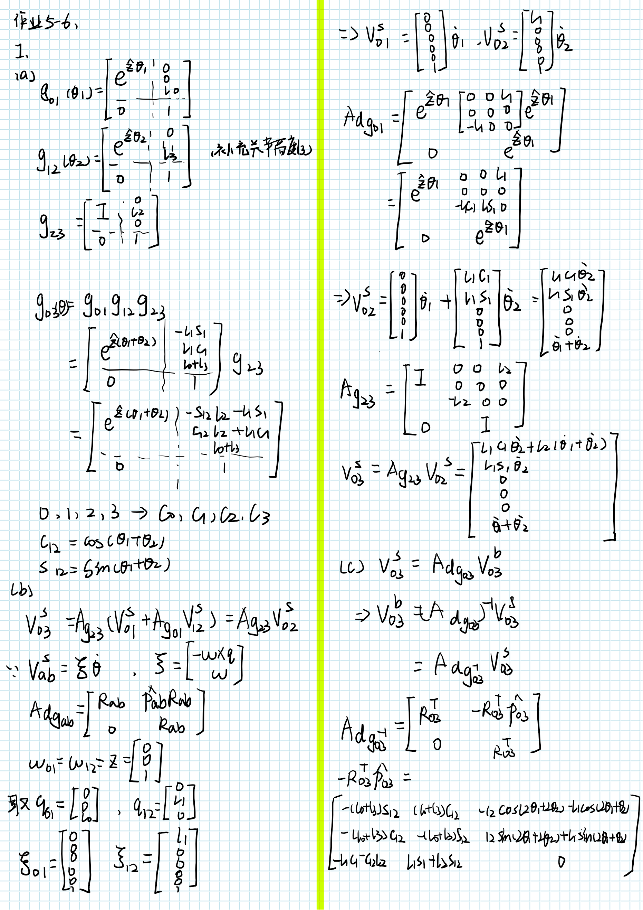
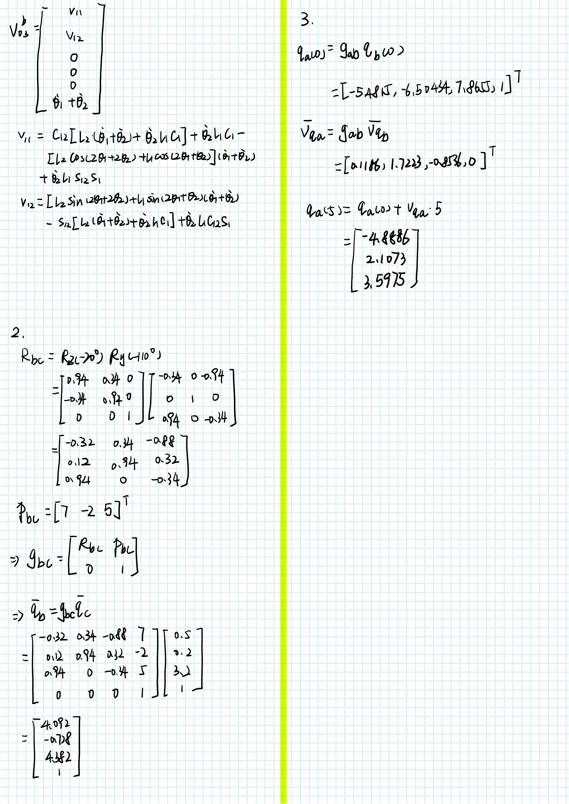
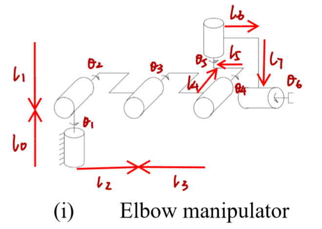
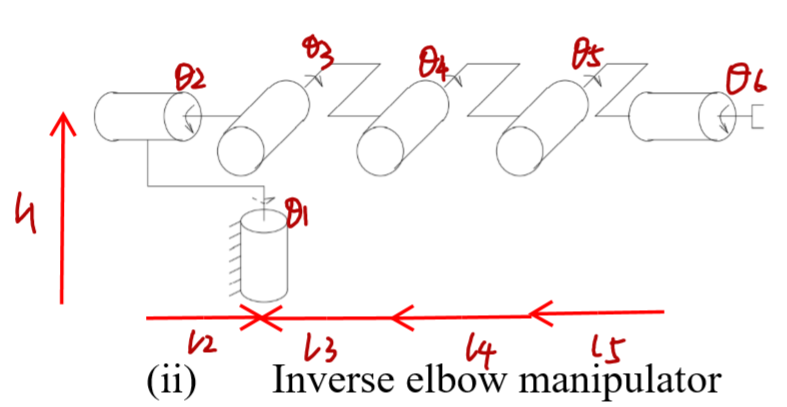
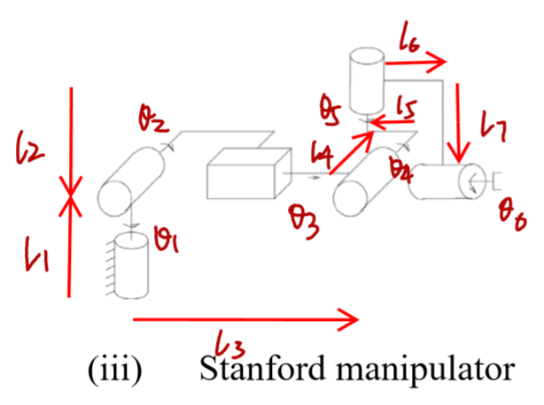

# 机器人学导论作业5-6

SZ170320207

刘健恒





## 4.

### （i）

假设变量如图



#### matlab

```matlab
clear;
clc;
syms theta1 theta2 theta3 theta4 theta5 theta6;
syms l0 l1 l2 l3 l4 l5 l6 l7;

gst0=[rotx(-90),[0;l3+l4+l5;l1];
        0,0,0,1];

w1=[0;0;1];w5=w1;
w2=[1;0;0];w3=w2;w4=w2;
w6=[0;1;0];

q1=[0;0;0];
q2=[0;0;l0];
q3=[0;l2;l0];
q4=[0;l2+l3;l0];
q5=[-l4;l2+l3-l5;0];
q6=[-l4;l2+l3-l5+l6;l0+l1-l7];

v1 = -cross(w1,q1);
s1=[v1;w1];
v2 = -cross(w2,q2);
s2=[v2;w2];
v3 = -cross(w3,q3);
s3=[v3;w3];
v4 = -cross(w4,q4);
s4=[v4;w4];
v5 = -cross(w5,q5);
s5=[v5;w5];
v6 = -cross(w6,q6);
s6=[v6;w6];

expw1=angvec2r(theta1,w1);
expw2=angvec2r(theta2,w2);
expw3=angvec2r(theta3,w3);
expw4=angvec2r(theta4,w4);
expw5=angvec2r(theta5,w5);
expw6=angvec2r(theta6,w6);


exps1=[expw1,(eye(3)-expw1)*cross(w1,v1)+w1*w1'*v1*theta1;0,0,0,1];
exps2=[expw2,(eye(3)-expw2)*cross(w2,v2)+w2*w2'*v2*theta2;0,0,0,1];
exps3=[expw3,(eye(3)-expw3)*cross(w3,v3)+w3*w3'*v3*theta3;0,0,0,1];
exps4=[expw4,(eye(3)-expw4)*cross(w4,v4)+w4*w4'*v4*theta4;0,0,0,1];
exps5=[expw5,(eye(3)-expw5)*cross(w5,v5)+w5*w5'*v5*theta5;0,0,0,1];
exps6=[expw6,(eye(3)-expw6)*cross(w6,v6)+w6*w6'*v6*theta6;0,0,0,1];

gst_theta=exps1*exps2*exps3*exps4*exps5*exps6*gst0;
gst_theta=simplify(gst_theta)
```

##### 结果

```matlab
gst_theta =
 
[ cos(theta6)*(cos(theta1)*cos(theta5) - cos(theta2 + theta3 + theta4)*sin(theta1)*sin(theta5)) - sin(theta2 + theta3 + theta4)*sin(theta1)*sin(theta6), - sin(theta6)*(cos(theta1)*cos(theta5) - cos(theta2 + theta3 + theta4)*sin(theta1)*sin(theta5)) - sin(theta2 + theta3 + theta4)*cos(theta6)*sin(theta1), - cos(theta1)*sin(theta5) - cos(theta2 + theta3 + theta4)*cos(theta5)*sin(theta1), l1*(sin(theta2 + theta3 + theta4)*cos(theta6)*sin(theta1) + cos(theta1)*cos(theta5)*sin(theta6) - cos(theta2 + theta3 + theta4)*sin(theta1)*sin(theta5)*sin(theta6)) - (cos(theta1)*sin(theta5) + cos(theta2 + theta3 + theta4)*cos(theta5)*sin(theta1))*(l3 + l4 + l5) + (l4*(cos(theta6) - 1) - sin(theta6)*(l0 + l1 - l7))*(cos(theta1)*cos(theta5) - cos(theta2 + theta3 + theta4)*sin(theta1)*sin(theta5)) + cos(theta1)*(l4*(cos(theta5) - 1) + sin(theta5)*(l2 + l3 - l5)) + cos(theta2 + theta3 + theta4)*sin(theta1)*((cos(theta5) - 1)*(l2 + l3 - l5) - l4*sin(theta5)) - sin(theta2 + theta3 + theta4)*sin(theta1)*((cos(theta6) - 1)*(l0 + l1 - l7) + l4*sin(theta6)) - cos(theta2 + theta3)*sin(theta1)*(l2 + l3 - l2*cos(theta4) - l3*cos(theta4) + l0*sin(theta4)) - sin(theta2 + theta3)*sin(theta1)*(l0*cos(theta4) - l0 + l2*sin(theta4) + l3*sin(theta4)) - cos(theta2)*sin(theta1)*(l2 - l2*cos(theta3) + l0*sin(theta3)) - l0*sin(theta1)*sin(theta2) - sin(theta1)*sin(theta2)*(l0*cos(theta3) - l0 + l2*sin(theta3))]
[ cos(theta6)*(cos(theta5)*sin(theta1) + cos(theta2 + theta3 + theta4)*cos(theta1)*sin(theta5)) + sin(theta2 + theta3 + theta4)*cos(theta1)*sin(theta6),   sin(theta2 + theta3 + theta4)*cos(theta1)*cos(theta6) - sin(theta6)*(cos(theta5)*sin(theta1) + cos(theta2 + theta3 + theta4)*cos(theta1)*sin(theta5)),   cos(theta2 + theta3 + theta4)*cos(theta1)*cos(theta5) - sin(theta1)*sin(theta5), l1*(cos(theta5)*sin(theta1)*sin(theta6) - sin(theta2 + theta3 + theta4)*cos(theta1)*cos(theta6) + cos(theta2 + theta3 + theta4)*cos(theta1)*sin(theta5)*sin(theta6)) - (sin(theta1)*sin(theta5) - cos(theta2 + theta3 + theta4)*cos(theta1)*cos(theta5))*(l3 + l4 + l5) + (l4*(cos(theta6) - 1) - sin(theta6)*(l0 + l1 - l7))*(cos(theta5)*sin(theta1) + cos(theta2 + theta3 + theta4)*cos(theta1)*sin(theta5)) + sin(theta1)*(l4*(cos(theta5) - 1) + sin(theta5)*(l2 + l3 - l5)) - cos(theta2 + theta3 + theta4)*cos(theta1)*((cos(theta5) - 1)*(l2 + l3 - l5) - l4*sin(theta5)) + sin(theta2 + theta3 + theta4)*cos(theta1)*((cos(theta6) - 1)*(l0 + l1 - l7) + l4*sin(theta6)) + cos(theta2 + theta3)*cos(theta1)*(l2 + l3 - l2*cos(theta4) - l3*cos(theta4) + l0*sin(theta4)) + sin(theta2 + theta3)*cos(theta1)*(l0*cos(theta4) - l0 + l2*sin(theta4) + l3*sin(theta4)) + cos(theta1)*cos(theta2)*(l2 - l2*cos(theta3) + l0*sin(theta3)) + l0*cos(theta1)*sin(theta2) + cos(theta1)*sin(theta2)*(l0*cos(theta3) - l0 + l2*sin(theta3))]
[                                                     sin(theta2 + theta3 + theta4)*cos(theta6)*sin(theta5) - cos(theta2 + theta3 + theta4)*sin(theta6),                                                     - cos(theta2 + theta3 + theta4)*cos(theta6) - sin(theta2 + theta3 + theta4)*sin(theta5)*sin(theta6),                                         sin(theta2 + theta3 + theta4)*cos(theta5),                                                                                                                                                                               l1*(cos(theta2 + theta3)*cos(theta4)*cos(theta6) - sin(theta2 + theta3)*cos(theta6)*sin(theta4) + cos(theta2 + theta3)*sin(theta4)*sin(theta5)*sin(theta6) + sin(theta2 + theta3)*cos(theta4)*sin(theta5)*sin(theta6)) - cos(theta2 + theta3 + theta4)*((cos(theta6) - 1)*(l0 + l1 - l7) + l4*sin(theta6)) - sin(theta2 + theta3 + theta4)*((cos(theta5) - 1)*(l2 + l3 - l5) - l4*sin(theta5)) - cos(theta2 + theta3)*(l0*cos(theta4) - l0 + l2*sin(theta4) + l3*sin(theta4)) - l0*(cos(theta2) - 1) + sin(theta2 + theta3)*(l2 + l3 - l2*cos(theta4) - l3*cos(theta4) + l0*sin(theta4)) + sin(theta2)*(l2 - l2*cos(theta3) + l0*sin(theta3)) - cos(theta2)*(l0*cos(theta3) - l0 + l2*sin(theta3)) + sin(theta2 + theta3 + theta4)*cos(theta5)*(l3 + l4 + l5) + sin(theta2 + theta3 + theta4)*sin(theta5)*(l4*(cos(theta6) - 1) - sin(theta6)*(l0 + l1 - l7))]
[                                                                                                                                                     0,                                                                                                                                                       0,                                                                                 0,                                                                                                                                                                                                                                                                                                                                                                                                                                                                                                                                                                                                                                                                                                                                                                                                                                                                                                                                                                                                                                           1]
 
```

### （ii）

假设变量如图



#### matlab

```matlab
clear;
clc;
syms theta1 theta2 theta3 theta4 theta5 theta6;
syms l1 l2 l3 l4 l5 l6;

gst0=[rotx(-90),[0;l3+l4+l5;l1];
        0,0,0,1];

w1=[0;0;1];
w2=[0;1;0];w6=w2;
w3=[1;0;0];w4=w3;w5=w3;

q1=[0;0;0];
q2=[0;0;l1];
q3=[0;0;l1];
q4=[0;l3;l1];
q5=[0;l3+l4;l1];
q6=[0;0;l1];

v1 = -cross(w1,q1);
s1=[v1;w1];
v2 = -cross(w2,q2);
s2=[v2;w2];
v3 = -cross(w3,q3);
s3=[v3;w3];
v4 = -cross(w4,q4);
s4=[v4;w4];
v5 = -cross(w5,q5);
s5=[v5;w5];
v6 = -cross(w6,q6);
s6=[v6;w6];

expw1=angvec2r(theta1,w1);
expw2=angvec2r(theta2,w2);
expw3=angvec2r(theta3,w3);
expw4=angvec2r(theta4,w4);
expw5=angvec2r(theta5,w5);
expw6=angvec2r(theta6,w6);


exps1=[expw1,(eye(3)-expw1)*cross(w1,v1)+w1*w1'*v1*theta1;0,0,0,1];
exps2=[expw2,(eye(3)-expw2)*cross(w2,v2)+w2*w2'*v2*theta2;0,0,0,1];
exps3=[expw3,(eye(3)-expw3)*cross(w3,v3)+w3*w3'*v3*theta3;0,0,0,1];
exps4=[expw4,(eye(3)-expw4)*cross(w4,v4)+w4*w4'*v4*theta4;0,0,0,1];
exps5=[expw5,(eye(3)-expw5)*cross(w5,v5)+w5*w5'*v5*theta5;0,0,0,1];
exps6=[expw6,(eye(3)-expw6)*cross(w6,v6)+w6*w6'*v6*theta6;0,0,0,1];

gst_theta=exps1*exps2*exps3*exps4*exps5*exps6*gst0;
gst_theta=simplify(gst_theta)
```

##### 结果

```matlab
gst_theta =
 
[ cos(theta1)*cos(theta2)*cos(theta6) - sin(theta6)*(cos(theta5)*(cos(theta4)*(sin(theta1)*sin(theta3) + cos(theta1)*cos(theta3)*sin(theta2)) + sin(theta4)*(cos(theta3)*sin(theta1) - cos(theta1)*sin(theta2)*sin(theta3))) + sin(theta5)*(cos(theta4)*(cos(theta3)*sin(theta1) - cos(theta1)*sin(theta2)*sin(theta3)) - sin(theta4)*(sin(theta1)*sin(theta3) + cos(theta1)*cos(theta3)*sin(theta2)))), - cos(theta6)*(cos(theta5)*(cos(theta4)*(sin(theta1)*sin(theta3) + cos(theta1)*cos(theta3)*sin(theta2)) + sin(theta4)*(cos(theta3)*sin(theta1) - cos(theta1)*sin(theta2)*sin(theta3))) + sin(theta5)*(cos(theta4)*(cos(theta3)*sin(theta1) - cos(theta1)*sin(theta2)*sin(theta3)) - sin(theta4)*(sin(theta1)*sin(theta3) + cos(theta1)*cos(theta3)*sin(theta2)))) - cos(theta1)*cos(theta2)*sin(theta6), sin(theta5)*(cos(theta4)*(sin(theta1)*sin(theta3) + cos(theta1)*cos(theta3)*sin(theta2)) + sin(theta4)*(cos(theta3)*sin(theta1) - cos(theta1)*sin(theta2)*sin(theta3))) - cos(theta5)*(cos(theta4)*(cos(theta3)*sin(theta1) - cos(theta1)*sin(theta2)*sin(theta3)) - sin(theta4)*(sin(theta1)*sin(theta3) + cos(theta1)*cos(theta3)*sin(theta2))), l3*cos(theta1)*sin(theta2)*sin(theta3) - l4*cos(theta3)*cos(theta4)*sin(theta1) - l3*cos(theta3)*sin(theta1) + l4*sin(theta1)*sin(theta3)*sin(theta4) - l5*cos(theta3)*cos(theta4)*cos(theta5)*sin(theta1) + l4*cos(theta1)*cos(theta3)*sin(theta2)*sin(theta4) + l4*cos(theta1)*cos(theta4)*sin(theta2)*sin(theta3) + l5*cos(theta3)*sin(theta1)*sin(theta4)*sin(theta5) + l5*cos(theta4)*sin(theta1)*sin(theta3)*sin(theta5) + l5*cos(theta5)*sin(theta1)*sin(theta3)*sin(theta4) + l5*cos(theta1)*cos(theta3)*cos(theta4)*sin(theta2)*sin(theta5) + l5*cos(theta1)*cos(theta3)*cos(theta5)*sin(theta2)*sin(theta4) + l5*cos(theta1)*cos(theta4)*cos(theta5)*sin(theta2)*sin(theta3) - l5*cos(theta1)*sin(theta2)*sin(theta3)*sin(theta4)*sin(theta5)]
[ sin(theta6)*(cos(theta5)*(cos(theta4)*(cos(theta1)*sin(theta3) - cos(theta3)*sin(theta1)*sin(theta2)) + sin(theta4)*(cos(theta1)*cos(theta3) + sin(theta1)*sin(theta2)*sin(theta3))) + sin(theta5)*(cos(theta4)*(cos(theta1)*cos(theta3) + sin(theta1)*sin(theta2)*sin(theta3)) - sin(theta4)*(cos(theta1)*sin(theta3) - cos(theta3)*sin(theta1)*sin(theta2)))) + cos(theta2)*cos(theta6)*sin(theta1),   cos(theta6)*(cos(theta5)*(cos(theta4)*(cos(theta1)*sin(theta3) - cos(theta3)*sin(theta1)*sin(theta2)) + sin(theta4)*(cos(theta1)*cos(theta3) + sin(theta1)*sin(theta2)*sin(theta3))) + sin(theta5)*(cos(theta4)*(cos(theta1)*cos(theta3) + sin(theta1)*sin(theta2)*sin(theta3)) - sin(theta4)*(cos(theta1)*sin(theta3) - cos(theta3)*sin(theta1)*sin(theta2)))) - cos(theta2)*sin(theta1)*sin(theta6), cos(theta5)*(cos(theta4)*(cos(theta1)*cos(theta3) + sin(theta1)*sin(theta2)*sin(theta3)) - sin(theta4)*(cos(theta1)*sin(theta3) - cos(theta3)*sin(theta1)*sin(theta2))) - sin(theta5)*(cos(theta4)*(cos(theta1)*sin(theta3) - cos(theta3)*sin(theta1)*sin(theta2)) + sin(theta4)*(cos(theta1)*cos(theta3) + sin(theta1)*sin(theta2)*sin(theta3))), l3*cos(theta1)*cos(theta3) + l4*cos(theta1)*cos(theta3)*cos(theta4) - l4*cos(theta1)*sin(theta3)*sin(theta4) + l3*sin(theta1)*sin(theta2)*sin(theta3) + l5*cos(theta1)*cos(theta3)*cos(theta4)*cos(theta5) - l5*cos(theta1)*cos(theta3)*sin(theta4)*sin(theta5) - l5*cos(theta1)*cos(theta4)*sin(theta3)*sin(theta5) - l5*cos(theta1)*cos(theta5)*sin(theta3)*sin(theta4) + l4*cos(theta3)*sin(theta1)*sin(theta2)*sin(theta4) + l4*cos(theta4)*sin(theta1)*sin(theta2)*sin(theta3) + l5*cos(theta3)*cos(theta4)*sin(theta1)*sin(theta2)*sin(theta5) + l5*cos(theta3)*cos(theta5)*sin(theta1)*sin(theta2)*sin(theta4) + l5*cos(theta4)*cos(theta5)*sin(theta1)*sin(theta2)*sin(theta3) - l5*sin(theta1)*sin(theta2)*sin(theta3)*sin(theta4)*sin(theta5)]
[                                                                                                                                                                                                                                                                                                                     - cos(theta6)*sin(theta2) - cos(theta3 + theta4 + theta5)*cos(theta2)*sin(theta6),                                                                                                                                                                                                                                                                                                                         sin(theta2)*sin(theta6) - cos(theta3 + theta4 + theta5)*cos(theta2)*cos(theta6),                                                                                                                                                                                                                                                                                                         sin(theta3 + theta4 + theta5)*cos(theta2),                                                                                                                                                                                                                                                                                                                                                                                                                   l1 + l3*cos(theta2)*sin(theta3) + l4*cos(theta2)*cos(theta3)*sin(theta4) + l4*cos(theta2)*cos(theta4)*sin(theta3) + l5*cos(theta2)*cos(theta3)*cos(theta4)*sin(theta5) + l5*cos(theta2)*cos(theta3)*cos(theta5)*sin(theta4) + l5*cos(theta2)*cos(theta4)*cos(theta5)*sin(theta3) - l5*cos(theta2)*sin(theta3)*sin(theta4)*sin(theta5)]
[                                                                                                                                                                                                                                                                                                                                                                                                     0,                                                                                                                                                                                                                                                                                                                                                                                                       0,                                                                                                                                                                                                                                                                                                                                                 0,                                                                                                                                                                                                                                                                                                                                                                                                                                                                                                                                                                                                                                                                                                                                                       1]
 
```

##### （iii）

假设变量如图



#### matlab

```matlab
clear;
clc;
syms theta1 theta2 theta3 theta4 theta5 theta6;
syms l1 l2 l3 l4 l5 l6 l7;

gst0=[rotx(-90),[0;l3+l4+l5;l1];
        0,0,0,1];

w1=[0;0;1];w5=w1;
w2=[1;0;0];w4=w2;
w6=[0;1;0];
w3=[0;0;0];

q1=[0;0;0];
q2=[0;0;l1];
q4=[0;l3;l1];
q5=[-l4;l3-l5;l1+l2];
q6=[-l4;l3-l5+l6;l1+l2-l7];

v1 = -cross(w1,q1);
s1=[v1;w1];
v2 = -cross(w2,q2);
s2=[v2;w2];
v3 = [0;1;0];% 纯平移
s3=[v3;w3]
v4 = -cross(w4,q4);
s4=[v4;w4];
v5 = -cross(w5,q5);
s5=[v5;w5];
v6 = -cross(w6,q6);
s6=[v6;w6];

expw1=angvec2r(theta1,w1);
expw2=angvec2r(theta2,w2);
expw3=eye(3);% 纯平移
expw4=angvec2r(theta4,w4);
expw5=angvec2r(theta5,w5);
expw6=angvec2r(theta6,w6);

exps1=[expw1,(eye(3)-expw1)*cross(w1,v1)+w1*w1'*v1*theta1;0,0,0,1];
exps2=[expw2,(eye(3)-expw2)*cross(w2,v2)+w2*w2'*v2*theta2;0,0,0,1];
exps3=[expw3,(eye(3)-expw3)*cross(w3,v3)+v3*theta3;0,0,0,1];% 纯平移
exps4=[expw4,(eye(3)-expw4)*cross(w4,v4)+w4*w4'*v4*theta4;0,0,0,1];
exps5=[expw5,(eye(3)-expw5)*cross(w5,v5)+w5*w5'*v5*theta5;0,0,0,1];
exps6=[expw6,(eye(3)-expw6)*cross(w6,v6)+w6*w6'*v6*theta6;0,0,0,1];

gst_theta=exps1*exps2*exps3*exps4*exps5*exps6*gst0;
gst_theta=simplify(gst_theta)
```

##### 结果

```matlab
gst_theta =
 
[ cos(theta6)*(cos(theta1)*cos(theta5) + sin(theta5)*(sin(theta1)*sin(theta2)*sin(theta4) - cos(theta2)*cos(theta4)*sin(theta1))) - sin(theta6)*(cos(theta2)*sin(theta1)*sin(theta4) + cos(theta4)*sin(theta1)*sin(theta2)), - sin(theta6)*(cos(theta1)*cos(theta5) + sin(theta5)*(sin(theta1)*sin(theta2)*sin(theta4) - cos(theta2)*cos(theta4)*sin(theta1))) - cos(theta6)*(cos(theta2)*sin(theta1)*sin(theta4) + cos(theta4)*sin(theta1)*sin(theta2)),   cos(theta5)*(sin(theta1)*sin(theta2)*sin(theta4) - cos(theta2)*cos(theta4)*sin(theta1)) - cos(theta1)*sin(theta5), (cos(theta1)*cos(theta5) + sin(theta5)*(sin(theta1)*sin(theta2)*sin(theta4) - cos(theta2)*cos(theta4)*sin(theta1)))*(l4*(cos(theta6) - 1) - sin(theta6)*(l1 + l2 - l7)) - (cos(theta1)*sin(theta5) - cos(theta5)*(sin(theta1)*sin(theta2)*sin(theta4) - cos(theta2)*cos(theta4)*sin(theta1)))*(l3 + l4 + l5) - ((cos(theta5) - 1)*(l3 - l5) - l4*sin(theta5))*(sin(theta1)*sin(theta2)*sin(theta4) - cos(theta2)*cos(theta4)*sin(theta1)) + l1*(sin(theta6)*(cos(theta1)*cos(theta5) + sin(theta5)*(sin(theta1)*sin(theta2)*sin(theta4) - cos(theta2)*cos(theta4)*sin(theta1))) + cos(theta6)*(cos(theta2)*sin(theta1)*sin(theta4) + cos(theta4)*sin(theta1)*sin(theta2))) + cos(theta1)*(l4*(cos(theta5) - 1) + sin(theta5)*(l3 - l5)) - (cos(theta2)*sin(theta1)*sin(theta4) + cos(theta4)*sin(theta1)*sin(theta2))*((cos(theta6) - 1)*(l1 + l2 - l7) + l4*sin(theta6)) + cos(theta2)*sin(theta1)*(l3*(cos(theta4) - 1) - l1*sin(theta4)) - sin(theta1)*sin(theta2)*(l1*(cos(theta4) - 1) + l3*sin(theta4)) - theta3*cos(theta2)*sin(theta1) - l1*sin(theta1)*sin(theta2)]
[ cos(theta6)*(cos(theta5)*sin(theta1) - sin(theta5)*(cos(theta1)*sin(theta2)*sin(theta4) - cos(theta1)*cos(theta2)*cos(theta4))) + sin(theta6)*(cos(theta1)*cos(theta2)*sin(theta4) + cos(theta1)*cos(theta4)*sin(theta2)),   cos(theta6)*(cos(theta1)*cos(theta2)*sin(theta4) + cos(theta1)*cos(theta4)*sin(theta2)) - sin(theta6)*(cos(theta5)*sin(theta1) - sin(theta5)*(cos(theta1)*sin(theta2)*sin(theta4) - cos(theta1)*cos(theta2)*cos(theta4))), - sin(theta1)*sin(theta5) - cos(theta5)*(cos(theta1)*sin(theta2)*sin(theta4) - cos(theta1)*cos(theta2)*cos(theta4)), l1*(sin(theta6)*(cos(theta5)*sin(theta1) - sin(theta5)*(cos(theta1)*sin(theta2)*sin(theta4) - cos(theta1)*cos(theta2)*cos(theta4))) - cos(theta6)*(cos(theta1)*cos(theta2)*sin(theta4) + cos(theta1)*cos(theta4)*sin(theta2))) - (sin(theta1)*sin(theta5) + cos(theta5)*(cos(theta1)*sin(theta2)*sin(theta4) - cos(theta1)*cos(theta2)*cos(theta4)))*(l3 + l4 + l5) + (cos(theta5)*sin(theta1) - sin(theta5)*(cos(theta1)*sin(theta2)*sin(theta4) - cos(theta1)*cos(theta2)*cos(theta4)))*(l4*(cos(theta6) - 1) - sin(theta6)*(l1 + l2 - l7)) + (cos(theta1)*cos(theta2)*sin(theta4) + cos(theta1)*cos(theta4)*sin(theta2))*((cos(theta6) - 1)*(l1 + l2 - l7) + l4*sin(theta6)) + sin(theta1)*(l4*(cos(theta5) - 1) + sin(theta5)*(l3 - l5)) + ((cos(theta5) - 1)*(l3 - l5) - l4*sin(theta5))*(cos(theta1)*sin(theta2)*sin(theta4) - cos(theta1)*cos(theta2)*cos(theta4)) - cos(theta1)*cos(theta2)*(l3*(cos(theta4) - 1) - l1*sin(theta4)) + cos(theta1)*sin(theta2)*(l1*(cos(theta4) - 1) + l3*sin(theta4)) + theta3*cos(theta1)*cos(theta2) + l1*cos(theta1)*sin(theta2)]
[                                                                                                                                           sin(theta2 + theta4)*cos(theta6)*sin(theta5) - cos(theta2 + theta4)*sin(theta6),                                                                                                                                           - cos(theta2 + theta4)*cos(theta6) - sin(theta2 + theta4)*sin(theta5)*sin(theta6),                                                                                    sin(theta2 + theta4)*cos(theta5),                                                                                                                                                                                                                                                                                                                                                                                                                                                                                                                          sin(theta2)*(l3 - l3*cos(theta4) + l1*sin(theta4)) - l1*(cos(theta2) - 1) + sin(theta2 + theta4)*(l3 - l5 - l3*cos(theta5) + l5*cos(theta5) + l4*sin(theta5)) - cos(theta2 + theta4)*((cos(theta6) - 1)*(l1 + l2 - l7) + l4*sin(theta6)) - cos(theta2)*(l1*cos(theta4) - l1 + l3*sin(theta4)) + theta3*sin(theta2) + l1*(cos(theta2 + theta4)*cos(theta6) + sin(theta2 + theta4)*sin(theta5)*sin(theta6)) + sin(theta2 + theta4)*cos(theta5)*(l3 + l4 + l5) + sin(theta2 + theta4)*sin(theta5)*(l4*(cos(theta6) - 1) - sin(theta6)*(l1 + l2 - l7))]
[                                                                                                                                                                                                                         0,                                                                                                                                                                                                                           0,                                                                                                                   0,                                                                                                                                                                                                                                                                                                                                                                                                                                                                                                                                                                                                                                                                                                                                                                                                                                                                                                                                                                                                                                                                           1]
 
```

