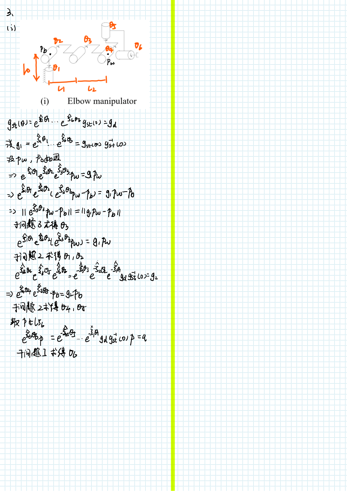

# 机器人学导论作业7-8

SZ170320207

刘健恒

## 1.

### 


**Matlab 代码**

```matlab
function [theta2,theta1] = PKsub2_non_intersecting(w2,w1,q2,q1,p,q)
%   exps1*exps2*p=q
%   w2:第一转角的转轴 w1:第二转角的转轴 q2:转轴w2上一点 q1:转轴w1上一点 p:初始点 q:终止点

u2=p-q2;
v2=q1-q2;
u2d=u2-w2*w2'*u2;
v2d=v2-w2*w2'*v2;
u2d_abs = sqrt(u2d'*u2d);
v2d_abs = sqrt(v2d'*v2d);

delta = sqrt((q-q1)'*(q-q1));
deltad_square = delta^2-(w2'*(p-q1))'*(w2'*(p-q1));

theta0=atan2(w2'*cross(u2d,v2d),u2d'*v2d);
Phi = acos((u2d_abs^2+v2d_abs^2-deltad_square)/(2*u2d_abs*v2d_abs));
theta2=theta0+Phi;

v2_s=-cross(w2,q2)
s2=[v2_s;w2];
expw2=angvec2r(theta2,w2);
exps2=[expw2,(eye(3)-expw2)*cross(w2,v2_s)+w2*w2'*v2_s*theta2;0,0,0,1];

p_ho=[p;1];
p1=mat2cell(exps2*p_ho,[3,1],[1]);
u1=p1{1,1}-q1;
v1=q-q1;
u1d=u1-w1*w1'*u1;
v1d=v1-w1*w1'*v1;
theta1=atan2(w1'*cross(u1d,v1d),u1d'*v1d);

end


```

**验证**

```matlab
>> [theta2,theta1] = PKsub2_non_intersecting([0;0;1],[0;0;1],[0;0;0],[0;2;0],[0;-1;1],[0;3;1])

theta2 =

    3.1416


theta1 =

   -3.1416
```

**正确！**


## 2.


**matlab程序**

```matlab
% 设r=（0，0，0）'
r=[0;0;0];
syms px py pz real;
p=[px;py;pz];
delta0=sqrt(p'*p);

% 通过三球面方程联立求得q点
syms x y z q1x q1y q1z delta1 q2x q2y q2z delta2 real;
eq1=(x-q1x)^2+(y-q1y)^2+(z-q1z)^2-delta1^2==0;
eq2=(x-q2y)^2+(y-q2y)^2+(z-q2z)^2-delta2^2==0;
% 设r点为（0，0，0）
eq3=x^2+y^2+z^2-delta0^2==0;
[x,y,z]=solve([eq1,eq2,eq3],[x,y,z],'Real',true);
q=[x,y,z];

% 子问题2
syms w1x w1y w1z w2x w2y w2z real;
w1=[w1x;w1y;w1z];
w2=[w2x;w2y;w2z];
u=p-r;
v=q-r
% 设z=c-r=αw1+βw2+Ω（w1xw2)
alpha=((w1'*w2)*w2'*u-w1'*v)/((w1'*w2)^2-1);
beta=((w1'*w2)*w1'*v-w2'*u)/((w1'*w2)^2-1);
gamma=(u'*u-alpha^2-beta^2-2*alpha*beta*w1'*w2)/(cross(w1,w2)'*cross(w1,w2));
z=alpha*w1+beta*w2+ssqrt(gamma)*cross(w1,w2);

% 子问题1
% v=c-r=z
u2=p-r;
u1=q-r;
v1=z;v2=z;
u2d=u2-w2*w2'*u2;
u1d=u1-w1*w1'*u1;
v2d=v2-w2*w2'*v2;
v1d=v1-w1*w1'*v1;

theta2=atan2(w2'*cross(u2d,v2d),u2d'*v2d);
theta1=atan2(w1'*cross(u1d,v1d),u1d'*v1d);
```

## 3.

### Paden-Kahan subproblems functions

#### **a.Subproblem1**

```matlab
function [theta] = PKsub1(w,r,p,q)
%   w转轴 r转轴上一点 p初始点 q终止点
u=p-r;
v=q-r;
ud=u-w*w'*u;
vd=v-w*w'*v;
theta=atan2(w'*cross(ud,vd),ud'*vd);
% theta=theta/pi*180;
end
```

**验证**

```matlab
>> PKsub1([0;0;1],[0;0;0],[1;0;1],[0;1;0])

ans =

    1.5708
```

**正确！**


#### **b.Subproblem2**

```matlab
function [theta2,theta1] = PKsub2(w2,w1,r,p,q)
%   exps1*exps2*p=q
%   w2第一转角的转轴 w1第二转角的转轴 r两转轴的交点 p初始点 q终止点

u=p-r;
v=q-r;
% 设z=c-r=αw1+βw2+Ω（w1xw2)
alpha=((w1'*w2)*w2'*u-w1'*v)/((w1'*w2)^2-1);
beta=((w1'*w2)*w1'*v-w2'*u)/((w1'*w2)^2-1);
gamma=(u'*u-alpha^2-beta^2-2*alpha*beta*w1'*w2)/(cross(w1,w2)'*cross(w1,w2));
z=alpha*w1+beta*w2+sqrt(gamma)*cross(w1,w2);

% c为中间过度点，两圆的交点
c=z+r;
% 转化为两个子问题1
% exp(s2h*theta2)*p=c
theta2 = PKsub1(w2,r,p,c);
% exp(-s1h*theta1)*q=c --> exp(s1h*theta1)*c=q
theta1= PKsub1(w1,r,c,q);
end


```

**验证**

```matlab
>> [theta2,theta1]=PKsub2([1;0;0],[0;0;1],[0;0;0],[1;0;1],[0;sqrt(2);0])

theta2 =

   -1.5708


theta1 =

    0.7854>> PKsub1([0;0;1],[0;0;0],[1;0;1],[0;1;0])

ans =

    1.5708
```

**正确！**


#### **c.Subproblem3**

```matlab
function [theta] = PKsub3(w,r,p,q,delta)
%   exp(sh*theta)*p-q=delta
%   w转轴 r转轴上一点 p初始点 q终止点 delta旋转后距离q的距离
u=p-r;
v=q-r;
ud=u-w*w'*u;
vd=v-w*w'*v
ud_abs = sqrt(ud'*ud);
vd_abs = sqrt(vd'*vd);
deltad_square = delta^2-(w'*(p-q))'*(w'*(p-q));

theta0=atan2(w'*cross(ud,vd),ud'*vd);
Phi = acos((ud_abs^2+vd_abs^2-deltad_square)/(2*ud_abs*vd_abs));
theta=theta0+Phi;
% 存在0，1，2解
% theta=theta0-Phi;
end

```

**验证**

```matlab
>> [theta]=PKsub3([0;0;1],[0;0;0],[1;0;1],[0;2;1],1)

theta =

    1.5708
```

**正确！**


### （i）



#### **Matlab**

##### **InverseKinematics_ElbowManipulator**

```matlab
function [theta1,theta2,theta3,theta4,theta5,theta6] = InverseKinematics_ElbowManipulator(gst0,gst_target,l0,l1,l2)
%	gst0:初始位姿 gst_target:目标位姿

w1=[0;0;1];w5=w1;
w2=[-1;0;0];w3=w2;w4=w2;
w6=[0;1;0];

q1=[0;0;0];
q2=[0;0;l0];
q3=[0;l1;l0];
q4=[0;l1+l2;l0];
q5=[0;l1+l2;0];
q6=q2;
pb=q2;
pw=q4;
pw_ho=[pw;1];

g1=gst_target*inv(gst0);
p1_ho=mat2cell(g1*pw_ho,[3,1],[1]);
p1=p1_ho{1,1};
theta3 = PKsub3(w3,q3,pw,pb,sqrt((p1-pb)'*(p1-pb)));

% exps为自己写的转化为指数形式的函数
exps3=exps(w3,q3,theta3);

p3_ho=mat2cell(exps3*pw_ho,[3,1],[1]);
p3=p3_ho{1,1};
[theta2,theta1] = PKsub2(w2,w1,pb,p3,p1);

exps2=exps(w2,q2,theta2);
exps1=exps(w1,q1,theta1);
% expinv为自己写的指数形式求逆函数
g2=expinv(exps3)*expinv(exps2)*expinv(exps1)*g1;
pb_ho=[pb;1];
p2_ho=mat2cell(g2*pb_ho,[3,1],[1]);
p2=p2_ho{1,1};
[theta5,theta4] = PKsub2(w5,w4,pw,pb,p2);

exps5=exps(w5,q5,theta5);
exps4=exps(w4,q4,theta4);

% p为不在w6上的一点
p=[1;0;0];
p_ho=[p;1];
p6_ho=mat2cell(expinv(exps5)*expinv(exps4)*g2*p_ho,[3,1],[1]);
p6=p6_ho{1,1};
[theta6] = PKsub1(w6,q6,p,p6);
end


```

##### **ForwardKinematics_ElbowManipulator**

```matlab
function [gst_target] = ForwardKinematics_ElbowManipulator(gst0,l0,l1,l2,theta1,theta2,theta3,theta4,theta5,theta6)
w1=[0;0;1];w4=w1;
w2=[-1;0;0];w3=w2;w5=w2;
w6=[0;1;0];

q1=[0;0;0];
q2=[0;0;l0];
q3=[0;l1;l0];
qw=[0;l1+l2;l0];q4=qw;q5=qw;q6=qw;


v1 = -cross(w1,q1);
s1=[v1;w1];
v2 = -cross(w2,q2);
s2=[v2;w2];
v3 = -cross(w3,q3);
s3=[v3;w3];
v4 = -cross(w4,q4);
s4=[v4;w4];
v5 = -cross(w5,q5);
s5=[v5;w5];
v6 = -cross(w6,q6);
s6=[v6;w6];

expw1=angvec2r(theta1,w1);
expw2=angvec2r(theta2,w2);
expw3=angvec2r(theta3,w3);
expw4=angvec2r(theta4,w4);
expw5=angvec2r(theta5,w5);
expw6=angvec2r(theta6,w6);


exps1=[expw1,(eye(3)-expw1)*cross(w1,v1)+w1*w1'*v1*theta1;0,0,0,1];
exps2=[expw2,(eye(3)-expw2)*cross(w2,v2)+w2*w2'*v2*theta2;0,0,0,1];
exps3=[expw3,(eye(3)-expw3)*cross(w3,v3)+w3*w3'*v3*theta3;0,0,0,1];
exps4=[expw4,(eye(3)-expw4)*cross(w4,v4)+w4*w4'*v4*theta4;0,0,0,1];
exps5=[expw5,(eye(3)-expw5)*cross(w5,v5)+w5*w5'*v5*theta5;0,0,0,1];
exps6=[expw6,(eye(3)-expw6)*cross(w6,v6)+w6*w6'*v6*theta6;0,0,0,1];

gst_target=exps1*exps2*exps3*exps4*exps5*exps6*gst0;
end
```

##### **验证**

```matlab
l0=1;
l1=1;
l2=1;

gst0=[eye(3),[0;l1+l2;l0];0,0,0,1]
gst_target=[eye(3),[0;l2;l0+l1];0,0,0,1]
[theta1,theta2,theta3,theta4,theta5,theta6] = InverseKinematics_ElbowManipulator(gst0,gst_target,l0,l1,l2)

[gst_FK] = ForwardKinematics_ElbowManipulator(gst0,l0,l1,l2,theta1,theta2,theta3,theta4,theta5,theta6)

l0=1;
l1=1;
l2=1;

gst0=[eye(3),[0;l1+l2;l0];0,0,0,1]
gst_target=[rotx(90),[0;l1+l2;l0];0,0,0,1]
[theta1,theta2,theta3,theta4,theta5,theta6] = InverseKinematics_ElbowManipulator(gst0,gst_target,l0,l1,l2)

[gst_FK] = ForwardKinematics_ElbowManipulator(gst0,l0,l1,l2,theta1,theta2,theta3,theta4,theta5,theta6)


```

**输出结果**

```matlab
gst0 = 4×4    
     1     0     0     0
     0     1     0     2
     0     0     1     1
     0     0     0     1

gst_target = 4×4    
     1     0     0     0
     0     1     0     1
     0     0     1     2
     0     0     0     1

theta1 = 3.1416
theta2 = -1.5708
theta3 = 4.7124
theta4 = 3.1416
theta5 = -3.1416
theta6 = -1.6653e-16
gst_FK = 4×4    
    1.0000    0.0000   -0.0000    0.0000
   -0.0000    1.0000   -0.0000    1.0000
    0.0000    0.0000    1.0000    2.0000
         0         0         0    1.0000

gst0 = 4×4    
     1     0     0     0
     0     1     0     2
     0     0     1     1
     0     0     0     1

gst_target = 4×4    
     1     0     0     0
     0     0    -1     2
     0     1     0     1
     0     0     0     1

theta1 = 3.1416
theta2 = -3.1416
theta3 = 6.2832
theta4 = -1.5708
theta5 = 3.1416
theta6 = -1.1102e-16
gst_FK = 4×4    
   -0.0000    1.0000   -0.0000    0.0000
   -1.0000   -0.0000    0.0000    2.0000
    0.0000    0.0000    1.0000    1.0000
         0         0         0    1.0000

```

**正确！**


### （ii）


#### **Matlab**

##### **InverseKinematics_InverseElbowManipulator**

```matlab
function [theta1,theta2,theta3,theta4,theta5,theta6] = InverseKinematics_InverseElbowManipulator(gst0,gst_target,l0,l1,l2)
%	gst0:初始位姿 gst_target:目标位姿

w1=[0;0;1];
w2=[0;1;0];w6=w2;
w3=[-1;0;0];w4=w3;w5=w3;

q1=[0;0;0];
q2=[0;0;l0];
q3=[0;0;l0];
q4=[0;l1;l0];
q5=[0;l1+l2;l0];
q6=q5;

g1=gst_target*inv(gst0);
p5=expsMultiplyVector(g1,q5);
theta1=atan2(-p5(1),p5(2));

% exps为自己写的转化为指数形式的函数
exps1=exps(w1,q1,theta1);
p51=expsMultiplyVector(expinv(exps1),p5);
theta2=atan2(p51(1),p51(3)-1);

exps2=exps(w2,q2,theta2);
p512=expsMultiplyVector(expinv(exps2),p51);
 [theta4,theta3] = PKsub2_non_intersecting(w4,w3,q4,q3,q5,p512);
 
exps3=exps(w3,q3,theta3);
exps4=exps(w4,q4,theta4);
%  p不属于w5和w6
p=[1;0;0];
q=expsMultiplyVector(expinv(exps4)*expinv(exps3)*expinv(exps2)*expinv(exps1)*g1,p)
 [theta6,theta5] = PKsub2(w6,w5,p5,p,q);
end


```

##### ForwardKinematics

```matlab
function [gst_target] = ForwardKinematics_InverseElbowManipulator(gst0,l0,l1,l2,theta1,theta2,theta3,theta4,theta5,theta6)
w1=[0;0;1];
w2=[0;1;0];w6=w2;
w3=[-1;0;0];w4=w3;w5=w3;

q1=[0;0;0];
q2=[0;0;l0];
q3=[0;0;l0];
q4=[0;l1;l0];
q5=[0;l1+l2;l0];
q6=q2;


v1 = -cross(w1,q1);
s1=[v1;w1];
v2 = -cross(w2,q2);
s2=[v2;w2];
v3 = -cross(w3,q3);
s3=[v3;w3];
v4 = -cross(w4,q4);
s4=[v4;w4];
v5 = -cross(w5,q5);
s5=[v5;w5];
v6 = -cross(w6,q6);
s6=[v6;w6];

expw1=angvec2r(theta1,w1);
expw2=angvec2r(theta2,w2);
expw3=angvec2r(theta3,w3);
expw4=angvec2r(theta4,w4);
expw5=angvec2r(theta5,w5);
expw6=angvec2r(theta6,w6);


exps1=[expw1,(eye(3)-expw1)*cross(w1,v1)+w1*w1'*v1*theta1;0,0,0,1];
exps2=[expw2,(eye(3)-expw2)*cross(w2,v2)+w2*w2'*v2*theta2;0,0,0,1];
exps3=[expw3,(eye(3)-expw3)*cross(w3,v3)+w3*w3'*v3*theta3;0,0,0,1];
exps4=[expw4,(eye(3)-expw4)*cross(w4,v4)+w4*w4'*v4*theta4;0,0,0,1];
exps5=[expw5,(eye(3)-expw5)*cross(w5,v5)+w5*w5'*v5*theta5;0,0,0,1];
exps6=[expw6,(eye(3)-expw6)*cross(w6,v6)+w6*w6'*v6*theta6;0,0,0,1];

gst_target=exps1*exps2*exps3*exps4*exps5*exps6*gst0;
end
```

##### **验证**

```matlab
l0=1;
l1=1;
l2=1;

gst0=[eye(3),[0;l1+l2;l0];0,0,0,1]
gst_target=[eye(3),[0;l1;l0];0,0,0,1]
[theta1,theta2,theta3,theta4,theta5,theta6] = InverseKinematics_InverseElbowManipulator(gst0,gst_target,l0,l1,l2)
[gst_FK] = ForwardKinematics_InverseElbowManipulator(gst0,l0,l1,l2,theta1,theta2,theta3,theta4,theta5,theta6)

gst0=[eye(3),[0;l1+l2;l0];0,0,0,1]
gst_target=[rotx(90),[0;l1+l2;l0];0,0,0,1]
[theta1,theta2,theta3,theta4,theta5,theta6] = InverseKinematics_InverseElbowManipulator(gst0,gst_target,l0,l1,l2)
[gst_FK] = ForwardKinematics_InverseElbowManipulator(gst0,l0,l1,l2,theta1,theta2,theta3,theta4,theta5,theta6)

```

```matlab
gst0 = 4×4    
     1     0     0     0
     0     1     0     2
     0     0     1     1
     0     0     0     1

gst_target = 4×4    
     1     0     0     0
     0     1     0     1
     0     0     1     1
     0     0     0     1

theta1 = 0
theta2 = 0
theta3 = -1.0472
theta4 = 2.0944
theta5 = -1.1555
theta6 = 0
gst_FK = 4×4    
    1.0000         0         0         0
         0    0.9941   -0.1081    1.0000
         0    0.1081    0.9941    1.0000
         0         0         0    1.0000

gst0 = 4×4    
     1     0     0     0
     0     1     0     2
     0     0     1     1
     0     0     0     1

gst_target = 4×4    
     1     0     0     0
     0     0    -1     2
     0     1     0     1
     0     0     0     1

theta1 = 0
theta2 = 0
theta3 = 0
theta4 = 0
theta5 = -1.5708
theta6 = 0
gst_FK = 4×4    
    1.0000         0         0         0
         0    0.0000   -1.0000    2.0000
         0    1.0000    0.0000    1.0000
         0         0         0    1.0000

```

**正确！**

### （iii)


#### **Matlab**

##### InverseKinematics_StanfordManipulator

```matlab
function [theta1,theta2,theta3,theta4,theta5,theta6] = InverseKinematics_StanfordManipulator(gst0,gst_target,l0,l1,l2)
%	gst0:初始位姿 gst_target:目标位姿

w1=[0;0;1];w5=w1;
w2=[-1;0;0];w4=w2;
w6=[0;1;0];
w3=[0;0;0];

q1=[0;0;0];
q2=[0;0;l0];
q4=[0;l1;l0];
q5=[0;l1;0];
q6=q2;

g1=gst_target*inv(gst0);

theta3 = sqrt((l0-gst_target(3,4))^2+(gst_target(1,4)^2+gst_target(2,4)^2))-l1

p3=[q4(1);q4(2)+theta3;q4(3)];
p4=expsMultiplyVector(g1,q4);
[theta2,theta1] = PKsub2(w2,w1,q2,p3,p4);

exps3=[eye(3),[0;theta3;0];0,0,0,1];
exps2=exps(w2,q2,theta2);
exps1=exps(w1,q1,theta1);
p2=expsMultiplyVector(expinv(exps3)*expinv(exps2)*expinv(exps1)*g1,q2);
[theta5,theta4] = PKsub2(w5,w4,q4,q2,p2);


exps5=exps(w5,q5,theta5);
exps4=exps(w4,q4,theta4);
p=[1;0;0];
q=expsMultiplyVector(expinv(exps5)*expinv(exps4)*expinv(exps3)*expinv(exps2)*expinv(exps1)*g1,p);
[theta6] = PKsub1(w6,q6,p,q);
end


```

##### ForwardKinematics_StanfordManipulator

```matlab
function [gst_target] = ForwardKinematics_StanfordManipulator(gst0,l0,l1,theta1,theta2,theta3,theta4,theta5,theta6)

w1=[0;0;1];w5=w1;
w2=[-1;0;0];w4=w2;
w6=[0;1;0];
w3=[0;0;0];

q1=[0;0;0];
q2=[0;0;l0];
q4=[0;l1;l0];
q5=[0;l1;0];
q6=q2;

v1 = -cross(w1,q1);
s1=[v1;w1];
v2 = -cross(w2,q2);
s2=[v2;w2];
v3 = [0;1;0];% 纯平移
s3=[v3;w3]
v4 = -cross(w4,q4);
s4=[v4;w4];
v5 = -cross(w5,q5);
s5=[v5;w5];
v6 = -cross(w6,q6);
s6=[v6;w6];

expw1=angvec2r(theta1,w1);
expw2=angvec2r(theta2,w2);
expw3=eye(3);% 纯平移
expw4=angvec2r(theta4,w4);
expw5=angvec2r(theta5,w5);
expw6=angvec2r(theta6,w6);

exps1=[expw1,(eye(3)-expw1)*cross(w1,v1)+w1*w1'*v1*theta1;0,0,0,1];
exps2=[expw2,(eye(3)-expw2)*cross(w2,v2)+w2*w2'*v2*theta2;0,0,0,1];
exps3=[expw3,(eye(3)-expw3)*cross(w3,v3)+v3*theta3;0,0,0,1];% 纯平移
exps4=[expw4,(eye(3)-expw4)*cross(w4,v4)+w4*w4'*v4*theta4;0,0,0,1];
exps5=[expw5,(eye(3)-expw5)*cross(w5,v5)+w5*w5'*v5*theta5;0,0,0,1];
exps6=[expw6,(eye(3)-expw6)*cross(w6,v6)+w6*w6'*v6*theta6;0,0,0,1];

gst_target=exps1*exps2*exps3*exps4*exps5*exps6*gst0
end
```

##### **验证**

```matlab
l0=1;
l1=1;

gst0=[eye(3),[0;l1;l0];0,0,0,1]
gst_target=[eye(3),[0;l1+1;l0];0,0,0,1]
[theta1,theta2,theta3,theta4,theta5,theta6] = InverseKinematics_StanfordManipulator(gst0,gst_target,l0,l1,l2)
[gst_FK] = ForwardKinematics_StanfordManipulator(gst0,l0,l1,theta1,theta2,theta3,theta4,theta5,theta6)

gst0=[eye(3),[0;l1;l0];0,0,0,1]
gst_target=[rotx(90),[0;l1+1;l0];0,0,0,1]
[theta1,theta2,theta3,theta4,theta5,theta6] = InverseKinematics_StanfordManipulator(gst0,gst_target,l0,l1,l2)
[gst_FK] = ForwardKinematics_StanfordManipulator(gst0,l0,l1,theta1,theta2,theta3,theta4,theta5,theta6)


```

```matlab
gst0 = 4×4    
     1     0     0     0
     0     1     0     1
     0     0     1     1
     0     0     0     1

gst_target = 4×4    
     1     0     0     0
     0     1     0     2
     0     0     1     1
     0     0     0     1

theta3 = 1
theta1 = 3.1416
theta2 = 3.1416
theta3 = 1
theta4 = 3.1416
theta5 = 3.1416
theta6 = 1.1102e-16
gst_FK = 4×4    
    1.0000    0.0000    0.0000    0.0000
   -0.0000    1.0000    0.0000    2.0000
   -0.0000   -0.0000    1.0000    1.0000
         0         0         0    1.0000

gst0 = 4×4    
     1     0     0     0
     0     1     0     1
     0     0     1     1
     0     0     0     1

gst_target = 4×4    
     1     0     0     0
     0     0    -1     2
     0     1     0     1
     0     0     0     1

theta3 = 1
theta1 = 3.1416
theta2 = 3.1416
theta3 = 1
theta4 = -1.5708
theta5 = 3.1416
theta6 = 2.2204e-16
gst_FK = 4×4    
    1.0000    0.0000    0.0000    0.0000
    0.0000    0.0000   -1.0000    2.0000
   -0.0000    1.0000    0.0000    1.0000
         0         0         0    1.0000

```


**正确！**