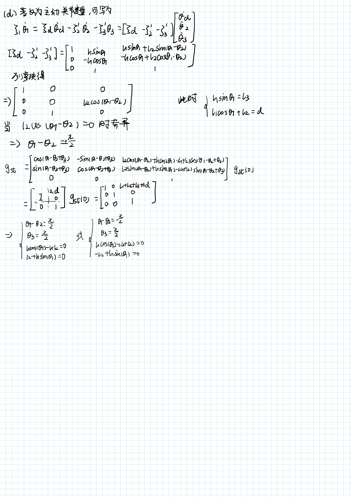

# 机器人学导论作业7-8

SZ170320207

刘健恒

## 1.

## （i）


**Matlab 代码**

```matlab
syms l0 l1 l2 theta1 theta2 theta3 theta4 theta5 theta6 real

w1=[0;0;1];w5=w1;
w2=[-1;0;0];w3=w2;w4=w2;
w6=[0;1;0];

q1=[0;0;0];
q2=[0;0;l0];
q3=[0;l1;l0];
qw=[0;l1+l2;l0];q4=qw;q5=qw;q6=qw;


v1 = -cross(w1,q1);
s1=[v1;w1];
v2 = -cross(w2,q2);
s2=[v2;w2];
v3 = -cross(w3,q3);
s3=[v3;w3];
v4 = -cross(w4,q4);
s4=[v4;w4];
v5 = -cross(w5,q5);
s5=[v5;w5];
v6 = -cross(w6,q6);
s6=[v6;w6];

expw1=angvec2r(theta1,w1);
expw2=angvec2r(theta2,w2);
expw3=angvec2r(theta3,w3);
expw4=angvec2r(theta4,w4);
expw5=angvec2r(theta5,w5);
expw6=angvec2r(theta6,w6);


exps1=[expw1,(eye(3)-expw1)*cross(w1,v1)+w1*w1'*v1*theta1;0,0,0,1];
exps2=[expw2,(eye(3)-expw2)*cross(w2,v2)+w2*w2'*v2*theta2;0,0,0,1];
exps3=[expw3,(eye(3)-expw3)*cross(w3,v3)+w3*w3'*v3*theta3;0,0,0,1];
exps4=[expw4,(eye(3)-expw4)*cross(w4,v4)+w4*w4'*v4*theta4;0,0,0,1];
exps5=[expw5,(eye(3)-expw5)*cross(w5,v5)+w5*w5'*v5*theta5;0,0,0,1];
exps6=[expw6,(eye(3)-expw6)*cross(w6,v6)+w6*w6'*v6*theta6;0,0,0,1];


q2d = expsMultiplyVector(exps1,q2);
q2d = simplify(q2d)
q3d = expsMultiplyVector(exps1*exps2,q3);
q3d = simplify(q3d)
q4d = expsMultiplyVector(exps1*exps2*exps3,q4);
q4d = simplify(q4d)
q5d = expsMultiplyVector(exps1*exps2*exps3*exps4,q5);
q5d = simplify(q5d)
q6d = expsMultiplyVector(exps1*exps2*exps3*exps4*exps5,q6);
q6d = simplify(q6d)


w2d=expw1*w2;
w2d=simplify(w2d)
w3d=expw1*expw2*w3;
w3d=simplify(w3d)
w4d=expw1*expw2*expw3*w4;
w4d=simplify(w4d)
w5d=expw1*expw2*expw3*expw4*w5;
w5d=simplify(w5d)
w6d=expw1*expw2*expw3*expw4*expw5*w6;
w6d=simplify(w6d)


s1d=lidaishu(w1,q1)

s2d=lidaishu(w2d,q2d);
s2d=simplify(s2d)
s3d=lidaishu(w3d,q3d);
s3d=simplify(s3d)
s4d=lidaishu(w4d,q4d);
s4d=simplify(s4d)
s5d=lidaishu(w5d,q5d);
s5d=simplify(s5d)
s6d=lidaishu(w6d,q6d);
s6d=simplify(s6d)

Jst_s=[s1d,s2d,s3d,s4d,s5d,s6d]

gst0 = [eye(3),[0;l1+l2;l0];0,0,0,1];
gst = exps1*exps2*exps3*exps4*exps5*exps6*gst0;
gst = simplify(gst);
Adj_gstinv = Adjoint_ginv(gst);
Jst_b = Adj_gstinv * Jst_s;
Jst_b = simplify(Jst_b)

```

**输出**


$J_{st}^s=$

$\begin{array}{l}
\left(\begin{array}{cccccc}
0 & l_0 \,\mathrm{sin}\left(\theta_1 \right) & \mathrm{sin}\left(\theta_1 \right)\,\sigma_6  & -\mathrm{sin}\left(\theta_1 \right)\,\sigma_1  & \sigma_3 \,\mathrm{cos}\left(\theta_1 \right)\,\sigma_1 +\sigma_9 \,\mathrm{cos}\left(\theta_1 \right)\,\sigma_2  & -{\left(\sigma_4 -\sigma_8 \right)}\,\sigma_1 -\sigma_3 \,\mathrm{cos}\left(\theta_1 \right)\,\mathrm{cos}\left(\theta_5 \right)\,\sigma_2 \\
0 & -l_0 \,\mathrm{cos}\left(\theta_1 \right) & -\mathrm{cos}\left(\theta_1 \right)\,\sigma_6  & \mathrm{cos}\left(\theta_1 \right)\,\sigma_1  & \sigma_3 \,\mathrm{sin}\left(\theta_1 \right)\,\sigma_1 +\sigma_9 \,\mathrm{sin}\left(\theta_1 \right)\,\sigma_2  & {\left(\sigma_5 +\sigma_7 \right)}\,\sigma_1 -\sigma_3 \,\mathrm{cos}\left(\theta_5 \right)\,\mathrm{sin}\left(\theta_1 \right)\,\sigma_2 \\
0 & 0 & l_1 \,\mathrm{cos}\left(\theta_2 \right) & \sigma_2  & 0 & \mathrm{sin}\left(\theta_5 \right)\,\sigma_2 \\
0 & -\mathrm{cos}\left(\theta_1 \right) & -\mathrm{cos}\left(\theta_1 \right) & -\mathrm{cos}\left(\theta_1 \right) & -\sigma_3 \,\mathrm{sin}\left(\theta_1 \right) & -\sigma_5 -\sigma_7 \\
0 & -\mathrm{sin}\left(\theta_1 \right) & -\mathrm{sin}\left(\theta_1 \right) & -\mathrm{sin}\left(\theta_1 \right) & \sigma_3 \,\mathrm{cos}\left(\theta_1 \right) & \sigma_8 -\sigma_4 \\
1 & 0 & 0 & 0 & \sigma_9  & -\sigma_3 \,\mathrm{cos}\left(\theta_5 \right)
\end{array}\right)\\
\mathrm{}\\
\textrm{where}\\
\mathrm{}\\
\;\;\sigma_1 =l_2 \,\mathrm{sin}\left(\theta_2 +\theta_3 \right)-l_0 +l_1 \,\mathrm{sin}\left(\theta_2 \right)\\
\mathrm{}\\
\;\;\sigma_2 =l_2 \,\mathrm{cos}\left(\theta_2 +\theta_3 \right)+l_1 \,\mathrm{cos}\left(\theta_2 \right)\\
\mathrm{}\\
\;\;\sigma_3 =\mathrm{sin}\left(\theta_2 +\theta_3 +\theta_4 \right)\\
\mathrm{}\\
\;\;\sigma_4 =\mathrm{sin}\left(\theta_1 \right)\,\mathrm{sin}\left(\theta_5 \right)\\
\mathrm{}\\
\;\;\sigma_5 =\mathrm{cos}\left(\theta_1 \right)\,\mathrm{sin}\left(\theta_5 \right)\\
\mathrm{}\\
\;\;\sigma_6 =l_0 -l_1 \,\mathrm{sin}\left(\theta_2 \right)\\
\mathrm{}\\
\;\;\sigma_7 =\sigma_9 \,\mathrm{cos}\left(\theta_5 \right)\,\mathrm{sin}\left(\theta_1 \right)\\
\mathrm{}\\
\;\;\sigma_8 =\sigma_9 \,\mathrm{cos}\left(\theta_1 \right)\,\mathrm{cos}\left(\theta_5 \right)\\
\mathrm{}\\
\;\;\sigma_9 =\mathrm{cos}\left(\theta_2 +\theta_3 +\theta_4 \right)
\end{array}$

$J_{st}^b=$

$\begin{array}{l}
\left(\begin{array}{cccccc}
-\mathrm{cos}\left(\theta_5 \right)\,\mathrm{cos}\left(\theta_6 \right)\,\sigma_1  & \sigma_7 +l_1 \,\mathrm{cos}\left(\theta_3 \right)\,\mathrm{cos}\left(\theta_4 \right)\,\mathrm{sin}\left(\theta_6 \right)+\sigma_6 -l_1 \,\mathrm{sin}\left(\theta_3 \right)\,\mathrm{sin}\left(\theta_4 \right)\,\mathrm{sin}\left(\theta_6 \right)+l_1 \,\mathrm{cos}\left(\theta_3 \right)\,\mathrm{cos}\left(\theta_6 \right)\,\mathrm{sin}\left(\theta_4 \right)\,\mathrm{sin}\left(\theta_5 \right)+l_1 \,\mathrm{cos}\left(\theta_4 \right)\,\mathrm{cos}\left(\theta_6 \right)\,\mathrm{sin}\left(\theta_3 \right)\,\mathrm{sin}\left(\theta_5 \right) & \sigma_7 +\sigma_6  & 0 & 0 & 0\\
\mathrm{sin}\left(\theta_5 \right)\,\sigma_1  & \mathrm{cos}\left(\theta_5 \right)\,{\left(l_1 \,\mathrm{sin}\left(\theta_3 +\theta_4 \right)+l_2 \,\mathrm{sin}\left(\theta_4 \right)\right)} & l_2 \,\mathrm{cos}\left(\theta_5 \right)\,\mathrm{sin}\left(\theta_4 \right) & 0 & 0 & 0\\
-\mathrm{cos}\left(\theta_5 \right)\,\mathrm{sin}\left(\theta_6 \right)\,\sigma_1  & l_1 \,\mathrm{cos}\left(\theta_6 \right)\,\mathrm{sin}\left(\theta_3 \right)\,\mathrm{sin}\left(\theta_4 \right)-l_1 \,\mathrm{cos}\left(\theta_3 \right)\,\mathrm{cos}\left(\theta_4 \right)\,\mathrm{cos}\left(\theta_6 \right)-\sigma_8 +\sigma_5 +l_1 \,\mathrm{cos}\left(\theta_3 \right)\,\mathrm{sin}\left(\theta_4 \right)\,\mathrm{sin}\left(\theta_5 \right)\,\mathrm{sin}\left(\theta_6 \right)+l_1 \,\mathrm{cos}\left(\theta_4 \right)\,\mathrm{sin}\left(\theta_3 \right)\,\mathrm{sin}\left(\theta_5 \right)\,\mathrm{sin}\left(\theta_6 \right) & \sigma_5 -\sigma_8  & 0 & 0 & 0\\
-\sigma_2 \,\mathrm{sin}\left(\theta_6 \right)-\sigma_9  & \sigma_4  & \sigma_4  & \sigma_4  & -\mathrm{sin}\left(\theta_6 \right) & \sigma_{10} \,\mathrm{cos}\left(\theta_5 \right)\,{\left(\sigma_2 \,\mathrm{sin}\left(\theta_6 \right)+\sigma_9 \right)}-{\left(\mathrm{cos}\left(\theta_6 \right)\,{\left(\mathrm{cos}\left(\theta_1 \right)\,\mathrm{cos}\left(\theta_5 \right)-\sigma_2 \,\mathrm{sin}\left(\theta_1 \right)\,\mathrm{sin}\left(\theta_5 \right)\right)}+\sigma_{10} \,\mathrm{sin}\left(\theta_1 \right)\,\mathrm{sin}\left(\theta_6 \right)\right)}\,{\left(\mathrm{cos}\left(\theta_1 \right)\,\mathrm{sin}\left(\theta_5 \right)+\sigma_2 \,\mathrm{cos}\left(\theta_5 \right)\,\mathrm{sin}\left(\theta_1 \right)\right)}-{\left(\mathrm{cos}\left(\theta_6 \right)\,{\left(\mathrm{cos}\left(\theta_5 \right)\,\mathrm{sin}\left(\theta_1 \right)+\sigma_2 \,\mathrm{cos}\left(\theta_1 \right)\,\mathrm{sin}\left(\theta_5 \right)\right)}-\sigma_{10} \,\mathrm{cos}\left(\theta_1 \right)\,\mathrm{sin}\left(\theta_6 \right)\right)}\,{\left(\mathrm{sin}\left(\theta_1 \right)\,\mathrm{sin}\left(\theta_5 \right)-\sigma_2 \,\mathrm{cos}\left(\theta_1 \right)\,\mathrm{cos}\left(\theta_5 \right)\right)}\\
-\sigma_{10} \,\mathrm{cos}\left(\theta_5 \right) & \mathrm{sin}\left(\theta_5 \right) & \mathrm{sin}\left(\theta_5 \right) & \mathrm{sin}\left(\theta_5 \right) & 0 & 1\\
\sigma_2 \,\mathrm{cos}\left(\theta_6 \right)-\sigma_{10} \,\mathrm{sin}\left(\theta_5 \right)\,\mathrm{sin}\left(\theta_6 \right) & \sigma_3  & \sigma_3  & \sigma_3  & \mathrm{cos}\left(\theta_6 \right) & 0
\end{array}\right)\\
\mathrm{}\\
\textrm{where}\\
\mathrm{}\\
\;\;\sigma_1 =l_2 \,\mathrm{cos}\left(\theta_2 +\theta_3 \right)+l_1 \,\mathrm{cos}\left(\theta_2 \right)\\
\mathrm{}\\
\;\;\sigma_2 =\mathrm{cos}\left(\theta_2 +\theta_3 +\theta_4 \right)\\
\mathrm{}\\
\;\;\sigma_3 =-\mathrm{cos}\left(\theta_5 \right)\,\mathrm{sin}\left(\theta_6 \right)\\
\mathrm{}\\
\;\;\sigma_4 =-\mathrm{cos}\left(\theta_5 \right)\,\mathrm{cos}\left(\theta_6 \right)\\
\mathrm{}\\
\;\;\sigma_5 =l_2 \,\mathrm{sin}\left(\theta_4 \right)\,\mathrm{sin}\left(\theta_5 \right)\,\mathrm{sin}\left(\theta_6 \right)\\
\mathrm{}\\
\;\;\sigma_6 =l_2 \,\mathrm{cos}\left(\theta_6 \right)\,\mathrm{sin}\left(\theta_4 \right)\,\mathrm{sin}\left(\theta_5 \right)\\
\mathrm{}\\
\;\;\sigma_7 =l_2 \,\mathrm{cos}\left(\theta_4 \right)\,\mathrm{sin}\left(\theta_6 \right)\\
\mathrm{}\\
\;\;\sigma_8 =l_2 \,\mathrm{cos}\left(\theta_4 \right)\,\mathrm{cos}\left(\theta_6 \right)\\
\mathrm{}\\
\;\;\sigma_9 =\sigma_{10} \,\mathrm{cos}\left(\theta_6 \right)\,\mathrm{sin}\left(\theta_5 \right)\\
\mathrm{}\\
\;\;\sigma_{10} =\mathrm{sin}\left(\theta_2 +\theta_3 +\theta_4 \right)
\end{array}$


## （ii）


**Matlab 代码**

```matlab
syms l0 l1 l2 theta1 theta2 theta3 theta4 theta5 theta6 real

w1=[0;0;1];
w2=[0;1;0];w6=w2;
w3=[-1;0;0];w4=w3;w5=w3;

q1=[0;0;0];
q2=[0;0;l0];
q3=[0;0;l0];
q4=[0;l1;l0];
q5=[0;l1+l2;l0];
q6=q2;


v1 = -cross(w1,q1);
s1=[v1;w1];
v2 = -cross(w2,q2);
s2=[v2;w2];
v3 = -cross(w3,q3);
s3=[v3;w3];
v4 = -cross(w4,q4);
s4=[v4;w4];
v5 = -cross(w5,q5);
s5=[v5;w5];
v6 = -cross(w6,q6);
s6=[v6;w6];

expw1=angvec2r(theta1,w1);
expw2=angvec2r(theta2,w2);
expw3=angvec2r(theta3,w3);
expw4=angvec2r(theta4,w4);
expw5=angvec2r(theta5,w5);
expw6=angvec2r(theta6,w6);


exps1=[expw1,(eye(3)-expw1)*cross(w1,v1)+w1*w1'*v1*theta1;0,0,0,1];
exps2=[expw2,(eye(3)-expw2)*cross(w2,v2)+w2*w2'*v2*theta2;0,0,0,1];
exps3=[expw3,(eye(3)-expw3)*cross(w3,v3)+w3*w3'*v3*theta3;0,0,0,1];
exps4=[expw4,(eye(3)-expw4)*cross(w4,v4)+w4*w4'*v4*theta4;0,0,0,1];
exps5=[expw5,(eye(3)-expw5)*cross(w5,v5)+w5*w5'*v5*theta5;0,0,0,1];
exps6=[expw6,(eye(3)-expw6)*cross(w6,v6)+w6*w6'*v6*theta6;0,0,0,1];


q2d = expsMultiplyVector(exps1,q2);
q2d = simplify(q2d)
q3d = expsMultiplyVector(exps1*exps2,q3);
q3d = simplify(q3d)
q4d = expsMultiplyVector(exps1*exps2*exps3,q4);
q4d = simplify(q4d)
q5d = expsMultiplyVector(exps1*exps2*exps3*exps4,q5);
q5d = simplify(q5d)
q6d = expsMultiplyVector(exps1*exps2*exps3*exps4*exps5,q6);
q6d = simplify(q6d)


w2d=expw1*w2;
w2d=simplify(w2d)
w3d=expw1*expw2*w3;
w3d=simplify(w3d)
w4d=expw1*expw2*expw3*w4;
w4d=simplify(w4d)
w5d=expw1*expw2*expw3*expw4*w5;
w5d=simplify(w5d)
w6d=expw1*expw2*expw3*expw4*expw5*w6;
w6d=simplify(w6d)


s1d=lidaishu(w1,q1)

s2d=lidaishu(w2d,q2d);
s2d=simplify(s2d)
s3d=lidaishu(w3d,q3d);
s3d=simplify(s3d)
s4d=lidaishu(w4d,q4d);
s4d=simplify(s4d)
s5d=lidaishu(w5d,q5d);
s5d=simplify(s5d)
s6d=lidaishu(w6d,q6d);
s6d=simplify(s6d)

Jst_s=[s1d,s2d,s3d,s4d,s5d,s6d]

gst0 = [eye(3),[0;l1+l2;l0];0,0,0,1];
gst = exps1*exps2*exps3*exps4*exps5*exps6*gst0;
gst = simplify(gst);
Adj_gstinv = Adjoint_ginv(gst);
Jst_b = Adj_gstinv * Jst_s;
Jst_b = simplify(Jst_b)


```

**输出**


$q_{6}'=$

$\begin{array}{l}
\left(\begin{array}{c}
\sigma_2 \,\sigma_8 +\sigma_1 \,\sigma_9 -l_0 \,{\left(\mathrm{cos}\left(\theta_5 \right)\,\sigma_9 +\mathrm{sin}\left(\theta_5 \right)\,\sigma_8 \right)}+\sigma_4 \,\sigma_{12} +\sigma_3 \,\sigma_{11} -l_0 \,\mathrm{cos}\left(\theta_1 \right)\,\mathrm{sin}\left(\theta_2 \right)+l_0 \,\mathrm{sin}\left(\theta_1 \right)\,\mathrm{sin}\left(\theta_3 \right)-l_0 \,\mathrm{cos}\left(\theta_1 \right)\,\mathrm{sin}\left(\theta_2 \right)\,{\left(\mathrm{cos}\left(\theta_3 \right)-1\right)}\\
l_0 \,{\left(\mathrm{cos}\left(\theta_5 \right)\,\sigma_{10} +\mathrm{sin}\left(\theta_5 \right)\,\sigma_7 \right)}-\sigma_1 \,\sigma_{10} -\sigma_2 \,\sigma_7 -\sigma_4 \,\sigma_{13} -\sigma_3 \,\sigma_{14} -l_0 \,\mathrm{cos}\left(\theta_1 \right)\,\mathrm{sin}\left(\theta_3 \right)-l_0 \,\mathrm{sin}\left(\theta_1 \right)\,\mathrm{sin}\left(\theta_2 \right)-l_0 \,\mathrm{sin}\left(\theta_1 \right)\,\mathrm{sin}\left(\theta_2 \right)\,{\left(\mathrm{cos}\left(\theta_3 \right)-1\right)}\\
l_0 -\frac{l_2 \,\mathrm{sin}\left(\theta_3 -\theta_2 +\theta_4 \right)}{2}+\frac{l_1 \,\sigma_6 }{2}+\frac{l_2 \,\sigma_6 }{2}-\frac{l_1 \,\mathrm{sin}\left(\theta_2 +\theta_3 \right)}{2}+\frac{l_1 \,\sigma_5 }{2}+\frac{l_2 \,\sigma_5 }{2}+\frac{l_1 \,\mathrm{sin}\left(\theta_2 -\theta_3 \right)}{2}-\frac{l_2 \,\mathrm{sin}\left(\theta_2 +\theta_3 +\theta_4 \right)}{2}
\end{array}\right)\\
\mathrm{}\\
\textrm{where}\\
\mathrm{}\\
\;\;\sigma_1 =l_0 \,{\left(\mathrm{cos}\left(\theta_5 \right)-1\right)}-\mathrm{sin}\left(\theta_5 \right)\,{\left(l_1 +l_2 \right)}\\
\mathrm{}\\
\;\;\sigma_2 =l_0 \,\mathrm{sin}\left(\theta_5 \right)+{\left(\mathrm{cos}\left(\theta_5 \right)-1\right)}\,{\left(l_1 +l_2 \right)}\\
\mathrm{}\\
\;\;\sigma_3 =l_0 \,{\left(\mathrm{cos}\left(\theta_4 \right)-1\right)}-l_1 \,\mathrm{sin}\left(\theta_4 \right)\\
\mathrm{}\\
\;\;\sigma_4 =l_1 \,{\left(\mathrm{cos}\left(\theta_4 \right)-1\right)}+l_0 \,\mathrm{sin}\left(\theta_4 \right)\\
\mathrm{}\\
\;\;\sigma_5 =\mathrm{sin}\left(\theta_3 -\theta_2 +\theta_4 +\theta_5 \right)\\
\mathrm{}\\
\;\;\sigma_6 =\mathrm{sin}\left(\theta_2 +\theta_3 +\theta_4 +\theta_5 \right)\\
\mathrm{}\\
\;\;\sigma_7 =\mathrm{cos}\left(\theta_4 \right)\,\sigma_{13} -\mathrm{sin}\left(\theta_4 \right)\,\sigma_{14} \\
\mathrm{}\\
\;\;\sigma_8 =\mathrm{cos}\left(\theta_4 \right)\,\sigma_{12} -\mathrm{sin}\left(\theta_4 \right)\,\sigma_{11} \\
\mathrm{}\\
\;\;\sigma_9 =\mathrm{cos}\left(\theta_4 \right)\,\sigma_{11} +\mathrm{sin}\left(\theta_4 \right)\,\sigma_{12} \\
\mathrm{}\\
\;\;\sigma_{10} =\mathrm{cos}\left(\theta_4 \right)\,\sigma_{14} +\mathrm{sin}\left(\theta_4 \right)\,\sigma_{13} \\
\mathrm{}\\
\;\;\sigma_{11} =\mathrm{sin}\left(\theta_1 \right)\,\mathrm{sin}\left(\theta_3 \right)-\mathrm{cos}\left(\theta_1 \right)\,\mathrm{cos}\left(\theta_3 \right)\,\mathrm{sin}\left(\theta_2 \right)\\
\mathrm{}\\
\;\;\sigma_{12} =\mathrm{cos}\left(\theta_3 \right)\,\mathrm{sin}\left(\theta_1 \right)+\mathrm{cos}\left(\theta_1 \right)\,\mathrm{sin}\left(\theta_2 \right)\,\mathrm{sin}\left(\theta_3 \right)\\
\mathrm{}\\
\;\;\sigma_{13} =\mathrm{cos}\left(\theta_1 \right)\,\mathrm{cos}\left(\theta_3 \right)-\mathrm{sin}\left(\theta_1 \right)\,\mathrm{sin}\left(\theta_2 \right)\,\mathrm{sin}\left(\theta_3 \right)\\
\mathrm{}\\
\;\;\sigma_{14} =\mathrm{cos}\left(\theta_1 \right)\,\mathrm{sin}\left(\theta_3 \right)+\mathrm{cos}\left(\theta_3 \right)\,\mathrm{sin}\left(\theta_1 \right)\,\mathrm{sin}\left(\theta_2 \right)
\end{array}$


$w_{6}'=$

$\begin{array}{l}
\left(\begin{array}{c}
\mathrm{sin}\left(\theta_5 \right)\,{\left(\mathrm{cos}\left(\theta_4 \right)\,\sigma_1 +\mathrm{sin}\left(\theta_4 \right)\,\sigma_3 \right)}-\mathrm{cos}\left(\theta_5 \right)\,{\left(\mathrm{cos}\left(\theta_4 \right)\,\sigma_3 -\mathrm{sin}\left(\theta_4 \right)\,\sigma_1 \right)}\\
\mathrm{cos}\left(\theta_5 \right)\,{\left(\mathrm{cos}\left(\theta_4 \right)\,\sigma_2 -\mathrm{sin}\left(\theta_4 \right)\,\sigma_4 \right)}-\mathrm{sin}\left(\theta_5 \right)\,{\left(\mathrm{cos}\left(\theta_4 \right)\,\sigma_4 +\mathrm{sin}\left(\theta_4 \right)\,\sigma_2 \right)}\\
-\mathrm{sin}\left(\theta_3 +\theta_4 +\theta_5 \right)\,\mathrm{cos}\left(\theta_2 \right)
\end{array}\right)\\
\mathrm{}\\
\textrm{where}\\
\mathrm{}\\
\;\;\sigma_1 =\mathrm{sin}\left(\theta_1 \right)\,\mathrm{sin}\left(\theta_3 \right)-\mathrm{cos}\left(\theta_1 \right)\,\mathrm{cos}\left(\theta_3 \right)\,\mathrm{sin}\left(\theta_2 \right)\\
\mathrm{}\\
\;\;\sigma_2 =\mathrm{cos}\left(\theta_1 \right)\,\mathrm{cos}\left(\theta_3 \right)-\mathrm{sin}\left(\theta_1 \right)\,\mathrm{sin}\left(\theta_2 \right)\,\mathrm{sin}\left(\theta_3 \right)\\
\mathrm{}\\
\;\;\sigma_3 =\mathrm{cos}\left(\theta_3 \right)\,\mathrm{sin}\left(\theta_1 \right)+\mathrm{cos}\left(\theta_1 \right)\,\mathrm{sin}\left(\theta_2 \right)\,\mathrm{sin}\left(\theta_3 \right)\\
\mathrm{}\\
\;\;\sigma_4 =\mathrm{cos}\left(\theta_1 \right)\,\mathrm{sin}\left(\theta_3 \right)+\mathrm{cos}\left(\theta_3 \right)\,\mathrm{sin}\left(\theta_1 \right)\,\mathrm{sin}\left(\theta_2 \right)
\end{array}$


$\xi_{4}'=$

$\begin{array}{l}
\left(\begin{array}{c}
l_1 \,\mathrm{sin}\left(\theta_2 \right)\,{\left(\mathrm{cos}\left(\theta_1 \right)\,\mathrm{cos}\left(\theta_3 \right)-\mathrm{sin}\left(\theta_1 \right)\,\mathrm{sin}\left(\theta_2 \right)\,\mathrm{sin}\left(\theta_3 \right)\right)}+\mathrm{cos}\left(\theta_2 \right)\,\mathrm{sin}\left(\theta_1 \right)\,\sigma_1 \\
l_1 \,\mathrm{sin}\left(\theta_2 \right)\,{\left(\mathrm{cos}\left(\theta_3 \right)\,\mathrm{sin}\left(\theta_1 \right)+\mathrm{cos}\left(\theta_1 \right)\,\mathrm{sin}\left(\theta_2 \right)\,\mathrm{sin}\left(\theta_3 \right)\right)}-\mathrm{cos}\left(\theta_1 \right)\,\mathrm{cos}\left(\theta_2 \right)\,\sigma_1 \\
l_1 \,\mathrm{cos}\left(\theta_2 \right)\,\mathrm{cos}\left(\theta_3 \right)\\
-\mathrm{cos}\left(\theta_1 \right)\,\mathrm{cos}\left(\theta_2 \right)\\
-\mathrm{cos}\left(\theta_2 \right)\,\mathrm{sin}\left(\theta_1 \right)\\
\mathrm{sin}\left(\theta_2 \right)
\end{array}\right)\\
\mathrm{}\\
\textrm{where}\\
\mathrm{}\\
\;\;\sigma_1 =l_0 -l_1 \,\mathrm{cos}\left(\theta_2 \right)\,\mathrm{sin}\left(\theta_3 \right)
\end{array}$

$\xi_{5}'=$

$\begin{array}{l}
\left(\begin{array}{c}
-\mathrm{sin}\left(\theta_2 \right)\,{\left(l_2 \,\mathrm{cos}\left(\theta_1 \right)\,\mathrm{sin}\left(\theta_3 \right)\,\mathrm{sin}\left(\theta_4 \right)-l_2 \,\mathrm{cos}\left(\theta_1 \right)\,\mathrm{cos}\left(\theta_3 \right)\,\mathrm{cos}\left(\theta_4 \right)-l_1 \,\mathrm{cos}\left(\theta_1 \right)\,\mathrm{cos}\left(\theta_3 \right)+l_1 \,\mathrm{sin}\left(\theta_1 \right)\,\mathrm{sin}\left(\theta_2 \right)\,\mathrm{sin}\left(\theta_3 \right)+l_2 \,\mathrm{cos}\left(\theta_3 \right)\,\mathrm{sin}\left(\theta_1 \right)\,\mathrm{sin}\left(\theta_2 \right)\,\mathrm{sin}\left(\theta_4 \right)+l_2 \,\mathrm{cos}\left(\theta_4 \right)\,\mathrm{sin}\left(\theta_1 \right)\,\mathrm{sin}\left(\theta_2 \right)\,\mathrm{sin}\left(\theta_3 \right)\right)}-\mathrm{cos}\left(\theta_2 \right)\,\mathrm{sin}\left(\theta_1 \right)\,\sigma_1 \\
\mathrm{sin}\left(\theta_2 \right)\,{\left(l_1 \,\mathrm{cos}\left(\theta_3 \right)\,\mathrm{sin}\left(\theta_1 \right)+l_2 \,\mathrm{cos}\left(\theta_3 \right)\,\mathrm{cos}\left(\theta_4 \right)\,\mathrm{sin}\left(\theta_1 \right)+l_1 \,\mathrm{cos}\left(\theta_1 \right)\,\mathrm{sin}\left(\theta_2 \right)\,\mathrm{sin}\left(\theta_3 \right)-l_2 \,\mathrm{sin}\left(\theta_1 \right)\,\mathrm{sin}\left(\theta_3 \right)\,\mathrm{sin}\left(\theta_4 \right)+l_2 \,\mathrm{cos}\left(\theta_1 \right)\,\mathrm{cos}\left(\theta_3 \right)\,\mathrm{sin}\left(\theta_2 \right)\,\mathrm{sin}\left(\theta_4 \right)+l_2 \,\mathrm{cos}\left(\theta_1 \right)\,\mathrm{cos}\left(\theta_4 \right)\,\mathrm{sin}\left(\theta_2 \right)\,\mathrm{sin}\left(\theta_3 \right)\right)}+\mathrm{cos}\left(\theta_1 \right)\,\mathrm{cos}\left(\theta_2 \right)\,\sigma_1 \\
\mathrm{cos}\left(\theta_2 \right)\,{\left(l_2 \,\mathrm{cos}\left(\theta_3 +\theta_4 \right)+l_1 \,\mathrm{cos}\left(\theta_3 \right)\right)}\\
-\mathrm{cos}\left(\theta_1 \right)\,\mathrm{cos}\left(\theta_2 \right)\\
-\mathrm{cos}\left(\theta_2 \right)\,\mathrm{sin}\left(\theta_1 \right)\\
\mathrm{sin}\left(\theta_2 \right)
\end{array}\right)\\
\mathrm{}\\
\textrm{where}\\
\mathrm{}\\
\;\;\sigma_1 =l_1 \,\mathrm{cos}\left(\theta_2 \right)\,\mathrm{sin}\left(\theta_3 \right)-l_0 +l_2 \,\mathrm{cos}\left(\theta_2 \right)\,\mathrm{cos}\left(\theta_3 \right)\,\mathrm{sin}\left(\theta_4 \right)+l_2 \,\mathrm{cos}\left(\theta_2 \right)\,\mathrm{cos}\left(\theta_4 \right)\,\mathrm{sin}\left(\theta_3 \right)
\end{array}$

$\xi_{6}'=$

```matlab
 
 l0*cos(theta1)*cos(theta3)*sin(theta4)*sin(theta5) - l0*cos(theta1)*cos(theta3)*cos(theta4)*cos(theta5) - l1*cos(theta1)*cos(theta2)*cos(theta4)*sin(theta5) - l1*cos(theta1)*cos(theta2)*cos(theta5)*sin(theta4) - l2*cos(theta1)*cos(theta2)*sin(theta5) + l0*cos(theta1)*cos(theta4)*sin(theta3)*sin(theta5) + l0*cos(theta1)*cos(theta5)*sin(theta3)*sin(theta4) + l0*cos(theta3)*cos(theta4)*sin(theta1)*sin(theta2)*sin(theta5) + l0*cos(theta3)*cos(theta5)*sin(theta1)*sin(theta2)*sin(theta4) + l0*cos(theta4)*cos(theta5)*sin(theta1)*sin(theta2)*sin(theta3) - l0*sin(theta1)*sin(theta2)*sin(theta3)*sin(theta4)*sin(theta5)
 l0*cos(theta3)*sin(theta1)*sin(theta4)*sin(theta5) - l0*cos(theta3)*cos(theta4)*cos(theta5)*sin(theta1) - l1*cos(theta2)*cos(theta4)*sin(theta1)*sin(theta5) - l1*cos(theta2)*cos(theta5)*sin(theta1)*sin(theta4) - l2*cos(theta2)*sin(theta1)*sin(theta5) + l0*cos(theta4)*sin(theta1)*sin(theta3)*sin(theta5) + l0*cos(theta5)*sin(theta1)*sin(theta3)*sin(theta4) - l0*cos(theta1)*cos(theta3)*cos(theta4)*sin(theta2)*sin(theta5) - l0*cos(theta1)*cos(theta3)*cos(theta5)*sin(theta2)*sin(theta4) - l0*cos(theta1)*cos(theta4)*cos(theta5)*sin(theta2)*sin(theta3) + l0*cos(theta1)*sin(theta2)*sin(theta3)*sin(theta4)*sin(theta5)
                                                                                                                                                                                                                                                                                                                                                                                                                                                                                                                                                                                   sin(theta2)*(l1*sin(theta4 + theta5) + l2*sin(theta5))
                                                                                                                                                                                                                                                                                        sin(theta5)*(cos(theta4)*(sin(theta1)*sin(theta3) - cos(theta1)*cos(theta3)*sin(theta2)) + sin(theta4)*(cos(theta3)*sin(theta1) + cos(theta1)*sin(theta2)*sin(theta3))) - cos(theta5)*(cos(theta4)*(cos(theta3)*sin(theta1) + cos(theta1)*sin(theta2)*sin(theta3)) - sin(theta4)*(sin(theta1)*sin(theta3) - cos(theta1)*cos(theta3)*sin(theta2)))
                                                                                                                                                                                                                                                                                        cos(theta5)*(cos(theta4)*(cos(theta1)*cos(theta3) - sin(theta1)*sin(theta2)*sin(theta3)) - sin(theta4)*(cos(theta1)*sin(theta3) + cos(theta3)*sin(theta1)*sin(theta2))) - sin(theta5)*(cos(theta4)*(cos(theta1)*sin(theta3) + cos(theta3)*sin(theta1)*sin(theta2)) + sin(theta4)*(cos(theta1)*cos(theta3) - sin(theta1)*sin(theta2)*sin(theta3)))
                                                                                                                                                                                                                                                                                                                                                                                                                                                                                                                                                                                               -sin(theta3 + theta4 + theta5)*cos(theta2)
 
 
```

$J_{st}^s=$

```matlab
Jst_s =
 
[ 0, -l0*cos(theta1),  l0*cos(theta2)*sin(theta1), l1*sin(theta2)*(cos(theta1)*cos(theta3) - sin(theta1)*sin(theta2)*sin(theta3)) + cos(theta2)*sin(theta1)*(l0 - l1*cos(theta2)*sin(theta3)), - sin(theta2)*(l2*cos(theta1)*sin(theta3)*sin(theta4) - l2*cos(theta1)*cos(theta3)*cos(theta4) - l1*cos(theta1)*cos(theta3) + l1*sin(theta1)*sin(theta2)*sin(theta3) + l2*cos(theta3)*sin(theta1)*sin(theta2)*sin(theta4) + l2*cos(theta4)*sin(theta1)*sin(theta2)*sin(theta3)) - cos(theta2)*sin(theta1)*(l1*cos(theta2)*sin(theta3) - l0 + l2*cos(theta2)*cos(theta3)*sin(theta4) + l2*cos(theta2)*cos(theta4)*sin(theta3)), l0*cos(theta1)*cos(theta3)*sin(theta4)*sin(theta5) - l0*cos(theta1)*cos(theta3)*cos(theta4)*cos(theta5) - l1*cos(theta1)*cos(theta2)*cos(theta4)*sin(theta5) - l1*cos(theta1)*cos(theta2)*cos(theta5)*sin(theta4) - l2*cos(theta1)*cos(theta2)*sin(theta5) + l0*cos(theta1)*cos(theta4)*sin(theta3)*sin(theta5) + l0*cos(theta1)*cos(theta5)*sin(theta3)*sin(theta4) + l0*cos(theta3)*cos(theta4)*sin(theta1)*sin(theta2)*sin(theta5) + l0*cos(theta3)*cos(theta5)*sin(theta1)*sin(theta2)*sin(theta4) + l0*cos(theta4)*cos(theta5)*sin(theta1)*sin(theta2)*sin(theta3) - l0*sin(theta1)*sin(theta2)*sin(theta3)*sin(theta4)*sin(theta5)]
[ 0, -l0*sin(theta1), -l0*cos(theta1)*cos(theta2), l1*sin(theta2)*(cos(theta3)*sin(theta1) + cos(theta1)*sin(theta2)*sin(theta3)) - cos(theta1)*cos(theta2)*(l0 - l1*cos(theta2)*sin(theta3)),   sin(theta2)*(l1*cos(theta3)*sin(theta1) + l2*cos(theta3)*cos(theta4)*sin(theta1) + l1*cos(theta1)*sin(theta2)*sin(theta3) - l2*sin(theta1)*sin(theta3)*sin(theta4) + l2*cos(theta1)*cos(theta3)*sin(theta2)*sin(theta4) + l2*cos(theta1)*cos(theta4)*sin(theta2)*sin(theta3)) + cos(theta1)*cos(theta2)*(l1*cos(theta2)*sin(theta3) - l0 + l2*cos(theta2)*cos(theta3)*sin(theta4) + l2*cos(theta2)*cos(theta4)*sin(theta3)), l0*cos(theta3)*sin(theta1)*sin(theta4)*sin(theta5) - l0*cos(theta3)*cos(theta4)*cos(theta5)*sin(theta1) - l1*cos(theta2)*cos(theta4)*sin(theta1)*sin(theta5) - l1*cos(theta2)*cos(theta5)*sin(theta1)*sin(theta4) - l2*cos(theta2)*sin(theta1)*sin(theta5) + l0*cos(theta4)*sin(theta1)*sin(theta3)*sin(theta5) + l0*cos(theta5)*sin(theta1)*sin(theta3)*sin(theta4) - l0*cos(theta1)*cos(theta3)*cos(theta4)*sin(theta2)*sin(theta5) - l0*cos(theta1)*cos(theta3)*cos(theta5)*sin(theta2)*sin(theta4) - l0*cos(theta1)*cos(theta4)*cos(theta5)*sin(theta2)*sin(theta3) + l0*cos(theta1)*sin(theta2)*sin(theta3)*sin(theta4)*sin(theta5)]
[ 0,               0,                           0,                                                                                                                 l1*cos(theta2)*cos(theta3),                                                                                                                                                                                                                                                                                                                                                                        cos(theta2)*(l2*cos(theta3 + theta4) + l1*cos(theta3)),                                                                                                                                                                                                                                                                                                                                                                                                                                                                                                                                                                                   sin(theta2)*(l1*sin(theta4 + theta5) + l2*sin(theta5))]
[ 0,    -sin(theta1),    -cos(theta1)*cos(theta2),                                                                                                                   -cos(theta1)*cos(theta2),                                                                                                                                                                                                                                                                                                                                                                                                      -cos(theta1)*cos(theta2),                                                                                                                                                                                                                                                                                        sin(theta5)*(cos(theta4)*(sin(theta1)*sin(theta3) - cos(theta1)*cos(theta3)*sin(theta2)) + sin(theta4)*(cos(theta3)*sin(theta1) + cos(theta1)*sin(theta2)*sin(theta3))) - cos(theta5)*(cos(theta4)*(cos(theta3)*sin(theta1) + cos(theta1)*sin(theta2)*sin(theta3)) - sin(theta4)*(sin(theta1)*sin(theta3) - cos(theta1)*cos(theta3)*sin(theta2)))]
[ 0,     cos(theta1),    -cos(theta2)*sin(theta1),                                                                                                                   -cos(theta2)*sin(theta1),                                                                                                                                                                                                                                                                                                                                                                                                      -cos(theta2)*sin(theta1),                                                                                                                                                                                                                                                                                        cos(theta5)*(cos(theta4)*(cos(theta1)*cos(theta3) - sin(theta1)*sin(theta2)*sin(theta3)) - sin(theta4)*(cos(theta1)*sin(theta3) + cos(theta3)*sin(theta1)*sin(theta2))) - sin(theta5)*(cos(theta4)*(cos(theta1)*sin(theta3) + cos(theta3)*sin(theta1)*sin(theta2)) + sin(theta4)*(cos(theta1)*cos(theta3) - sin(theta1)*sin(theta2)*sin(theta3)))]
[ 1,               0,                 sin(theta2),                                                                                                                                sin(theta2),                                                                                                                                                                                                                                                                                                                                                                                                                   sin(theta2),                                                                                                                                                                                                                                                                                                                                                                                                                                                                                                                                                                                               -sin(theta3 + theta4 + theta5)*cos(theta2)]
 
 
```


$J_{st}^b=$

```matlab
[ l2*cos(theta5)*sin(theta2)*sin(theta6) - l1*cos(theta2)*cos(theta3)*cos(theta6) - l2*cos(theta2)*cos(theta3)*cos(theta4)*cos(theta6) + l2*cos(theta2)*cos(theta6)*sin(theta3)*sin(theta4) + l1*cos(theta4)*cos(theta5)*sin(theta2)*sin(theta6) - l1*sin(theta2)*sin(theta4)*sin(theta5)*sin(theta6),                             -cos(theta6)*(l2*sin(theta3 + theta4) + l1*sin(theta3)),  sin(theta6)*(l1*cos(theta4 + theta5) + l2*cos(theta5)),  l2*cos(theta5)*sin(theta6),            0, 0]
[                                                                                                                                                                                                                                              sin(theta2)*(l1*sin(theta4 + theta5) + l2*sin(theta5)),                                                                                   0,                l1*sin(theta4 + theta5) + l2*sin(theta5),              l2*sin(theta5),            0, 0]
[ l2*cos(theta2)*sin(theta3)*sin(theta4)*sin(theta6) - l2*cos(theta5)*cos(theta6)*sin(theta2) - l2*cos(theta2)*cos(theta3)*cos(theta4)*sin(theta6) - l1*cos(theta4)*cos(theta5)*cos(theta6)*sin(theta2) - l1*cos(theta2)*cos(theta3)*sin(theta6) + l1*cos(theta6)*sin(theta2)*sin(theta4)*sin(theta5),                             -sin(theta6)*(l2*sin(theta3 + theta4) + l1*sin(theta3)), -cos(theta6)*(l1*cos(theta4 + theta5) + l2*cos(theta5)), -l2*cos(theta5)*cos(theta6),            0, 0]
[                                                                                                                                                                                                                   - cos(theta6)*sin(theta2) - cos(theta3 + theta4 + theta5)*cos(theta2)*sin(theta6), cos(theta3 + theta4 + theta5 + theta6)/2 - cos(theta3 + theta4 + theta5 - theta6)/2,                                            -cos(theta6),                -cos(theta6), -cos(theta6), 0]
[                                                                                                                                                                                                                                                          -sin(theta3 + theta4 + theta5)*cos(theta2),                                                       cos(theta3 + theta4 + theta5),                                                       0,                           0,            0, 1]
[                                                                                                                                                                                                                     cos(theta3 + theta4 + theta5)*cos(theta2)*cos(theta6) - sin(theta2)*sin(theta6), sin(theta3 + theta4 + theta5 - theta6)/2 + sin(theta3 + theta4 + theta5 + theta6)/2,                                            -sin(theta6),                -sin(theta6), -sin(theta6), 0]
 
```

## （iii）


**Matlab 代码**

```matlab
syms l0 l1 l2 theta1 theta2 theta3 theta4 theta5 theta6 real

w1=[0;0;1];w5=w1;
w2=[-1;0;0];w4=w2;
w6=[0;1;0];
w3=[0;0;0];

q1=[0;0;0];
q2=[0;0;l0];
q4=[0;l1;l0];
q5=[0;l1;0];
q6=q2;


v1 = -cross(w1,q1);
s1=[v1;w1];
v2 = -cross(w2,q2);
s2=[v2;w2];
v3 = -cross(w3,q3);
s3=[v3;w3];
v4 = -cross(w4,q4);
s4=[v4;w4];
v5 = -cross(w5,q5);
s5=[v5;w5];
v6 = -cross(w6,q6);
s6=[v6;w6];

v1 = -cross(w1,q1);
s1=[v1;w1];
v2 = -cross(w2,q2);
s2=[v2;w2];
v3 = [0;1;0];% 纯平移
s3=[v3;w3];
v4 = -cross(w4,q4);
s4=[v4;w4];
v5 = -cross(w5,q5);
s5=[v5;w5];
v6 = -cross(w6,q6);
s6=[v6;w6];

expw1=angvec2r(theta1,w1);
expw2=angvec2r(theta2,w2);
expw3=eye(3);% 纯平移
expw4=angvec2r(theta4,w4);
expw5=angvec2r(theta5,w5);
expw6=angvec2r(theta6,w6);

exps1=[expw1,(eye(3)-expw1)*cross(w1,v1)+w1*w1'*v1*theta1;0,0,0,1];
exps2=[expw2,(eye(3)-expw2)*cross(w2,v2)+w2*w2'*v2*theta2;0,0,0,1];
exps3=[expw3,(eye(3)-expw3)*cross(w3,v3)+v3*theta3;0,0,0,1];% 纯平移
exps4=[expw4,(eye(3)-expw4)*cross(w4,v4)+w4*w4'*v4*theta4;0,0,0,1];
exps5=[expw5,(eye(3)-expw5)*cross(w5,v5)+w5*w5'*v5*theta5;0,0,0,1];
exps6=[expw6,(eye(3)-expw6)*cross(w6,v6)+w6*w6'*v6*theta6;0,0,0,1];


q2d = expsMultiplyVector(exps1,q2);
q2d = simplify(q2d)
q3d = expsMultiplyVector(exps1*exps2,q3);
q3d = simplify(q3d)
q4d = expsMultiplyVector(exps1*exps2*exps3,q4);
q4d = simplify(q4d)
q5d = expsMultiplyVector(exps1*exps2*exps3*exps4,q5);
q5d = simplify(q5d)
q6d = expsMultiplyVector(exps1*exps2*exps3*exps4*exps5,q6);
q6d = simplify(q6d)


w2d=expw1*w2;
w2d=simplify(w2d)
v3d=expw1*expw2*v3;
w3d=expw1*expw2*w3;
w3d=simplify(w3d)
w4d=expw1*expw2*expw3*w4;
w4d=simplify(w4d)
w5d=expw1*expw2*expw3*expw4*w5;
w5d=simplify(w5d)
w6d=expw1*expw2*expw3*expw4*expw5*w6;
w6d=simplify(w6d)


s1d=lidaishu(w1,q1)

s2d=lidaishu(w2d,q2d);
s2d=simplify(s2d)
s3d=[v3d;w3d];%纯平移
s3d=simplify(s3d)
s4d=lidaishu(w4d,q4d);
s4d=simplify(s4d)
s5d=lidaishu(w5d,q5d);
s5d=simplify(s5d)
s6d=lidaishu(w6d,q6d);
s6d=simplify(s6d)

Jst_s=[s1d,s2d,s3d,s4d,s5d,s6d]

gst0 = [eye(3),[0;l1+l2;l0];0,0,0,1];
gst = exps1*exps2*exps3*exps4*exps5*exps6*gst0;
gst = simplify(gst);
Adj_gstinv = Adjoint_ginv(gst);
Jst_b = Adj_gstinv * Jst_s;
Jst_b = simplify(Jst_b)


```

**输出**


$J_{st}^s=$

$\begin{array}{l}
\left(\begin{array}{cccccc}
0 & l_0 \,\mathrm{sin}\left(\theta_1 \right) & -\mathrm{cos}\left(\theta_2 \right)\,\mathrm{sin}\left(\theta_1 \right) & -\mathrm{sin}\left(\theta_1 \right)\,\sigma_2  & \mathrm{cos}\left(\theta_1 \right)\,\sigma_1  & l_0 \,\mathrm{sin}\left(\theta_1 \right)\,\mathrm{sin}\left(\theta_5 \right)-l_1 \,\mathrm{cos}\left(\theta_1 \right)\,\mathrm{cos}\left(\theta_5 \right)\,\mathrm{sin}\left(\theta_4 \right)-\theta_3 \,\mathrm{cos}\left(\theta_1 \right)\,\mathrm{cos}\left(\theta_5 \right)\,\mathrm{sin}\left(\theta_4 \right)-l_1 \,\mathrm{sin}\left(\theta_1 \right)\,\mathrm{sin}\left(\theta_2 \right)\,\mathrm{sin}\left(\theta_5 \right)-\theta_3 \,\mathrm{sin}\left(\theta_1 \right)\,\mathrm{sin}\left(\theta_2 \right)\,\mathrm{sin}\left(\theta_5 \right)-l_0 \,\mathrm{cos}\left(\theta_1 \right)\,\mathrm{cos}\left(\theta_2 \right)\,\mathrm{cos}\left(\theta_4 \right)\,\mathrm{cos}\left(\theta_5 \right)+l_0 \,\mathrm{cos}\left(\theta_1 \right)\,\mathrm{cos}\left(\theta_5 \right)\,\mathrm{sin}\left(\theta_2 \right)\,\mathrm{sin}\left(\theta_4 \right)\\
0 & -l_0 \,\mathrm{cos}\left(\theta_1 \right) & \mathrm{cos}\left(\theta_1 \right)\,\mathrm{cos}\left(\theta_2 \right) & \mathrm{cos}\left(\theta_1 \right)\,\sigma_2  & \mathrm{sin}\left(\theta_1 \right)\,\sigma_1  & l_1 \,\mathrm{cos}\left(\theta_1 \right)\,\mathrm{sin}\left(\theta_2 \right)\,\mathrm{sin}\left(\theta_5 \right)-l_0 \,\mathrm{cos}\left(\theta_1 \right)\,\mathrm{sin}\left(\theta_5 \right)-l_1 \,\mathrm{cos}\left(\theta_5 \right)\,\mathrm{sin}\left(\theta_1 \right)\,\mathrm{sin}\left(\theta_4 \right)+\theta_3 \,\mathrm{cos}\left(\theta_1 \right)\,\mathrm{sin}\left(\theta_2 \right)\,\mathrm{sin}\left(\theta_5 \right)-\theta_3 \,\mathrm{cos}\left(\theta_5 \right)\,\mathrm{sin}\left(\theta_1 \right)\,\mathrm{sin}\left(\theta_4 \right)-l_0 \,\mathrm{cos}\left(\theta_2 \right)\,\mathrm{cos}\left(\theta_4 \right)\,\mathrm{cos}\left(\theta_5 \right)\,\mathrm{sin}\left(\theta_1 \right)+l_0 \,\mathrm{cos}\left(\theta_5 \right)\,\mathrm{sin}\left(\theta_1 \right)\,\mathrm{sin}\left(\theta_2 \right)\,\mathrm{sin}\left(\theta_4 \right)\\
0 & 0 & -\mathrm{sin}\left(\theta_2 \right) & \mathrm{cos}\left(\theta_2 \right)\,{\left(l_1 +\theta_3 \right)} & 0 & \mathrm{cos}\left(\theta_2 \right)\,\mathrm{sin}\left(\theta_5 \right)\,{\left(l_1 +\theta_3 \right)}\\
0 & -\mathrm{cos}\left(\theta_1 \right) & 0 & -\mathrm{cos}\left(\theta_1 \right) & -\mathrm{sin}\left(\theta_2 +\theta_4 \right)\,\mathrm{sin}\left(\theta_1 \right) & \mathrm{cos}\left(\theta_5 \right)\,{\left(\mathrm{sin}\left(\theta_1 \right)\,\mathrm{sin}\left(\theta_2 \right)\,\mathrm{sin}\left(\theta_4 \right)-\mathrm{cos}\left(\theta_2 \right)\,\mathrm{cos}\left(\theta_4 \right)\,\mathrm{sin}\left(\theta_1 \right)\right)}-\mathrm{cos}\left(\theta_1 \right)\,\mathrm{sin}\left(\theta_5 \right)\\
0 & -\mathrm{sin}\left(\theta_1 \right) & 0 & -\mathrm{sin}\left(\theta_1 \right) & \mathrm{sin}\left(\theta_2 +\theta_4 \right)\,\mathrm{cos}\left(\theta_1 \right) & -\mathrm{sin}\left(\theta_1 \right)\,\mathrm{sin}\left(\theta_5 \right)-\mathrm{cos}\left(\theta_5 \right)\,{\left(\mathrm{cos}\left(\theta_1 \right)\,\mathrm{sin}\left(\theta_2 \right)\,\mathrm{sin}\left(\theta_4 \right)-\mathrm{cos}\left(\theta_1 \right)\,\mathrm{cos}\left(\theta_2 \right)\,\mathrm{cos}\left(\theta_4 \right)\right)}\\
1 & 0 & 0 & 0 & \mathrm{cos}\left(\theta_2 +\theta_4 \right) & -\mathrm{sin}\left(\theta_2 +\theta_4 \right)\,\mathrm{cos}\left(\theta_5 \right)
\end{array}\right)\\
\mathrm{}\\
\textrm{where}\\
\mathrm{}\\
\;\;\sigma_1 =l_1 \,\mathrm{cos}\left(\theta_4 \right)-l_0 \,\mathrm{sin}\left(\theta_2 +\theta_4 \right)+\theta_3 \,\mathrm{cos}\left(\theta_4 \right)\\
\mathrm{}\\
\;\;\sigma_2 =l_1 \,\mathrm{sin}\left(\theta_2 \right)-l_0 +\theta_3 \,\mathrm{sin}\left(\theta_2 \right)
\end{array}$

$J_{st}^b=$

$\begin{array}{l}
\left(\begin{array}{cccccc}
l_2 \,\mathrm{cos}\left(\theta_6 \right)\,\mathrm{sin}\left(\theta_2 \right)\,\mathrm{sin}\left(\theta_4 \right)-l_2 \,\mathrm{cos}\left(\theta_2 \right)\,\mathrm{cos}\left(\theta_4 \right)\,\mathrm{cos}\left(\theta_6 \right)-\theta_3 \,\mathrm{cos}\left(\theta_2 \right)\,\mathrm{cos}\left(\theta_5 \right)\,\mathrm{cos}\left(\theta_6 \right)-l_1 \,\mathrm{cos}\left(\theta_2 \right)\,\mathrm{cos}\left(\theta_5 \right)\,\mathrm{cos}\left(\theta_6 \right)+l_2 \,\mathrm{cos}\left(\theta_2 \right)\,\mathrm{sin}\left(\theta_4 \right)\,\mathrm{sin}\left(\theta_5 \right)\,\mathrm{sin}\left(\theta_6 \right)+l_2 \,\mathrm{cos}\left(\theta_4 \right)\,\mathrm{sin}\left(\theta_2 \right)\,\mathrm{sin}\left(\theta_5 \right)\,\mathrm{sin}\left(\theta_6 \right) & l_1 \,\mathrm{cos}\left(\theta_4 \right)\,\mathrm{sin}\left(\theta_6 \right)+\sigma_3 +\theta_3 \,\mathrm{cos}\left(\theta_4 \right)\,\mathrm{sin}\left(\theta_6 \right)+l_1 \,\mathrm{cos}\left(\theta_6 \right)\,\mathrm{sin}\left(\theta_4 \right)\,\mathrm{sin}\left(\theta_5 \right)+\theta_3 \,\mathrm{cos}\left(\theta_6 \right)\,\mathrm{sin}\left(\theta_4 \right)\,\mathrm{sin}\left(\theta_5 \right) & \mathrm{cos}\left(\theta_4 \right)\,\mathrm{cos}\left(\theta_6 \right)\,\mathrm{sin}\left(\theta_5 \right)-\mathrm{sin}\left(\theta_4 \right)\,\mathrm{sin}\left(\theta_6 \right) & \sigma_3  & -l_2 \,\mathrm{cos}\left(\theta_6 \right) & 0\\
\mathrm{cos}\left(\theta_2 \right)\,\mathrm{sin}\left(\theta_5 \right)\,{\left(l_1 +\theta_3 \right)} & \mathrm{cos}\left(\theta_5 \right)\,\mathrm{sin}\left(\theta_4 \right)\,{\left(l_1 +\theta_3 \right)} & \mathrm{cos}\left(\theta_4 \right)\,\mathrm{cos}\left(\theta_5 \right) & 0 & 0 & 0\\
l_2 \,\mathrm{sin}\left(\theta_2 \right)\,\mathrm{sin}\left(\theta_4 \right)\,\mathrm{sin}\left(\theta_6 \right)-l_2 \,\mathrm{cos}\left(\theta_2 \right)\,\mathrm{cos}\left(\theta_4 \right)\,\mathrm{sin}\left(\theta_6 \right)-\theta_3 \,\mathrm{cos}\left(\theta_2 \right)\,\mathrm{cos}\left(\theta_5 \right)\,\mathrm{sin}\left(\theta_6 \right)-l_1 \,\mathrm{cos}\left(\theta_2 \right)\,\mathrm{cos}\left(\theta_5 \right)\,\mathrm{sin}\left(\theta_6 \right)-l_2 \,\mathrm{cos}\left(\theta_2 \right)\,\mathrm{cos}\left(\theta_6 \right)\,\mathrm{sin}\left(\theta_4 \right)\,\mathrm{sin}\left(\theta_5 \right)-l_2 \,\mathrm{cos}\left(\theta_4 \right)\,\mathrm{cos}\left(\theta_6 \right)\,\mathrm{sin}\left(\theta_2 \right)\,\mathrm{sin}\left(\theta_5 \right) & l_1 \,\mathrm{sin}\left(\theta_4 \right)\,\mathrm{sin}\left(\theta_5 \right)\,\mathrm{sin}\left(\theta_6 \right)-\sigma_4 -\theta_3 \,\mathrm{cos}\left(\theta_4 \right)\,\mathrm{cos}\left(\theta_6 \right)-l_1 \,\mathrm{cos}\left(\theta_4 \right)\,\mathrm{cos}\left(\theta_6 \right)+\theta_3 \,\mathrm{sin}\left(\theta_4 \right)\,\mathrm{sin}\left(\theta_5 \right)\,\mathrm{sin}\left(\theta_6 \right) & \mathrm{cos}\left(\theta_6 \right)\,\mathrm{sin}\left(\theta_4 \right)+\mathrm{cos}\left(\theta_4 \right)\,\mathrm{sin}\left(\theta_5 \right)\,\mathrm{sin}\left(\theta_6 \right) & -\sigma_4  & -l_2 \,\mathrm{sin}\left(\theta_6 \right) & 0\\
-\mathrm{cos}\left(\theta_2 +\theta_4 \right)\,\mathrm{sin}\left(\theta_6 \right)-\mathrm{sin}\left(\theta_2 +\theta_4 \right)\,\mathrm{cos}\left(\theta_6 \right)\,\mathrm{sin}\left(\theta_5 \right) & \sigma_2  & 0 & \sigma_2  & -\mathrm{sin}\left(\theta_6 \right) & 0\\
-\mathrm{sin}\left(\theta_2 +\theta_4 \right)\,\mathrm{cos}\left(\theta_5 \right) & \mathrm{sin}\left(\theta_5 \right) & 0 & \mathrm{sin}\left(\theta_5 \right) & 0 & 1\\
\mathrm{cos}\left(\theta_2 +\theta_4 \right)\,\mathrm{cos}\left(\theta_6 \right)-\mathrm{sin}\left(\theta_2 +\theta_4 \right)\,\mathrm{sin}\left(\theta_5 \right)\,\mathrm{sin}\left(\theta_6 \right) & \sigma_1  & 0 & \sigma_1  & \mathrm{cos}\left(\theta_6 \right) & 0
\end{array}\right)\\
\mathrm{}\\
\textrm{where}\\
\mathrm{}\\
\;\;\sigma_1 =-\mathrm{cos}\left(\theta_5 \right)\,\mathrm{sin}\left(\theta_6 \right)\\
\mathrm{}\\
\;\;\sigma_2 =-\mathrm{cos}\left(\theta_5 \right)\,\mathrm{cos}\left(\theta_6 \right)\\
\mathrm{}\\
\;\;\sigma_3 =l_2 \,\mathrm{cos}\left(\theta_5 \right)\,\mathrm{sin}\left(\theta_6 \right)\\
\mathrm{}\\
\;\;\sigma_4 =l_2 \,\mathrm{cos}\left(\theta_5 \right)\,\mathrm{cos}\left(\theta_6 \right)
\end{array}$


## 2.


## 3.


## 4.




